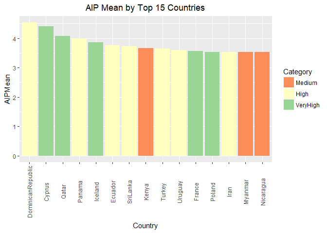
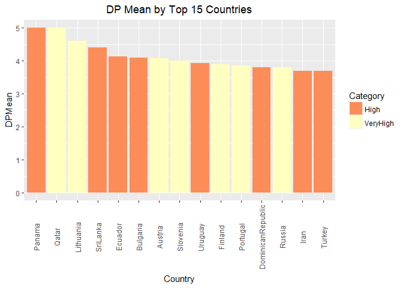

# CaseStudyTwo
Jim Park Asha Saxena Andrew Walch  
November 25, 2017  


#2a Read the csv into R and take a look at the data set. Output how many rows and columns the data.frame is.


```r
PD <- read.csv("Procrastination.csv")
dim(PD) #results in printing the number of rows then the number of columns.
```

```
## [1] 4264   61
```


#2b The column names are either too much or not enough. Change the column names so that they do not have spaces, underscores, slashes, and the like. All column names should be under 12 characters. Make sure you’re updating your codebook with information on the tidied data set as well.


```r
class(PD)
```

```
## [1] "data.frame"
```

```r
OldNames <- names(PD)
library(data.table)
PD.renamed <- setnames(PD, old=OldNames, new=c("Age", "Gender", "Kids", "Education","WorkStatus","AnnualIncome", "Occupation", "Years", "Months", "Community", "Country", "Status", "NumSon", "NumDaught", "DP1", "DP2","DP3","DP4","DP5","AIP1","AIP2","AIP3","AIP4","AIP5","AIP6","AIP7","AIP8","AIP9","AIP10","AIP11","AIP12","AIP13","AIP14","AIP15", "GP1", "GP2", "GP3", "GP4", "GP5", "GP6", "GP7", "GP8", "GP9", "GP10", "GP11", "GP12", "GP13", "GP14", "GP15", "GP16", "GP17", "GP18", "GP19", "GP20", "SWLS1", "SWLS2", "SWLS3", "SWLS4", "SWLS5","Q1Self","Q2Others"))
head(PD.renamed)
```

```
##    Age Gender     Kids Education WorkStatus AnnualIncome Occupation
## 1 67.5   Male Yes Kids        ma    retired        25000           
## 2 45.0   Male Yes Kids       deg  part-time        35000           
## 3 19.0 Female  No Kids       dip    student           NA           
## 4 37.5   Male Yes Kids        ma  full-time        45000           
## 5 28.0 Female  No Kids       deg  full-time        35000           
## 6 23.0 Female  No Kids       deg  full-time        15000           
##     Years Months  Community        Country   Status NumSon NumDaught DP1
## 1 9.0e+00      0 Large-City    El Salvador Divorced      0         5   3
## 2 1.5e-19      0    Village        Bolivia  Married   Male         1   3
## 3 0.0e+00      0 Large Town         Cyprus   Single      0         0   5
## 4 1.4e+01      0 Large Town Czech Republic  Married      0         1   3
## 5 1.0e+00      0    Village Czech Republic   Single      0         0   3
## 6 1.0e+00      0 Small Town Czech Republic   Single      0         0   3
##   DP2 DP3 DP4 DP5 AIP1 AIP2 AIP3 AIP4 AIP5 AIP6 AIP7 AIP8 AIP9 AIP10 AIP11
## 1   1   1   1   1    1    1    1    1    1    1    1    1    5     1     1
## 2   4   3   3   3    3    1    4    3    3    4    3    3    3     3     4
## 3   5   2   3   3    5    4    4    5    5    5    5    4    5     5     4
## 4   3   3   3   3    2    1    4    3    5    3    4    5    4     5     4
## 5   3   2   1   1    1    1    3    3    2    2    2    2    1     1     2
## 6   4   3   2   2    2    5    5    5    5    3    5    4    4     5     3
##   AIP12 AIP13 AIP14 AIP15 GP1 GP2 GP3 GP4 GP5 GP6 GP7 GP8 GP9 GP10 GP11
## 1     1     1     1     3   1   1   1   1   1   1   1   1   1    1    5
## 2     2     2     2     4   4   2   2   2   2   2   4   2   4    2    3
## 3     3     5     4     3   5   2   2   4   3   1   3   2   5    4    5
## 4     3     4     2     1   4   1   3   3   2   3   4   5   4    1    3
## 5     1     2     1     2   4   1   2   4   5   2   4   2   4    1    2
## 6     5     4     5     5   5   5   2   5   4   4   5   4   4    3    4
##   GP12 GP13 GP14 GP15 GP16 GP17 GP18 GP19 GP20 SWLS1 SWLS2 SWLS3 SWLS4
## 1    1    1    1    1    1    1    5    1    5     5     5     5     5
## 2    4    2    2    3    4    3    3    4    4     3     4     4     4
## 3    5    3    4    5    2    3    5    5    4     2     2     2     3
## 4    4    3    3    4    4    3    4    5    1     2     4     2     2
## 5    3    2    4    3    2    3    2    3    4     4     4     4     3
## 6    4    3    4    4    4    4    4    4    4     3     2     4     4
##   SWLS5 Q1Self Q2Others
## 1     5     no       no
## 2     3    yes      yes
## 3     4    yes      yes
## 4     2    yes      yes
## 5     4     no       no
## 6     3    yes      yes
```

#2c. Some columns are, due to Qualtrics, malfunctioning. Prime examples are the following columns: “How long have you held this position?: Years”, Country of residence, Number of sons, and Current Occupation.

i Some have impossible data values. Detail what you are doing to fix these columns in the raw data and why. It’s a judgment call for each, but explain why. For example, most people have not been doing anything for over 100 years. For the “Years” columns, round to the nearest integer.

ii Somehow, “Number of sons” was labeled with Male (1) and Female (2). Change these incorrect labels back to integers.

iii There are no “0” country of residences. Treat this as missing.

iv Current Occupation has no “please specify” or “0.” Treat them as missing. Some jobs are quite similar. Use judgment calls to make overwrite them into the same category. It does not have to be 100% accurate, but right now “ESL Teacher” would not be counted as “teacher” if there were unique counts.

#2Ci. Fix impossible data values.  Round Age and Years to nearest integer (negative exponents will default to 0 due to this), Correct Years '999' entries and treat as missing(NA), and correct number of sons entries where Male = 1 sons, and Female =2 sons, Change 0 in "Country" to NA to indicate the data is missing, change "please specify" or "0" under Occupation to NA to indicate missing, and combine similar occupations into category of occupation.

```r
PD.renamed$Age <- as.integer(round(PD.renamed$Age)) #rounds all Ages to the nearest integer and converts from numeric to integer.
PD.renamed$Years <- as.integer(round(PD.renamed$Years)) #rounds all Years to the nearest integer and converts from from numeric to integer.
PD.renamed$Years <- as.integer(gsub(999, NA, PD.renamed$Years)) #Removes 999 values and treats them as missing by indicating with an NA
PD.renamed$NumSon <- (gsub("Male", 1, PD.renamed$NumSon)) #subs a 1 where the word Male is listed in NumSon
PD.renamed$NumSon <- (gsub("Female", 2, PD.renamed$NumSon)) #subs a 2 where the word Female is listed in NumSon
PD.renamed$NumSon <- as.integer(PD.renamed$NumSon) #Converts NumSon to an integer.
PD.renamed$Country <- gsub(0, NA, PD.renamed$Country) #displays Country with 0 as missing data (NA)
PD.renamed$Country[PD.renamed$Country == ""] <- NA #replaces all non-entries with NA
PD.renamed$Occupation[PD.renamed$Occupation == 0] <- NA
PD.renamed$Occupation[PD.renamed$Occupation == "please specify"] <- NA
PD.renamed$Occupation[PD.renamed$Occupation == ""] <- NA
PD.renamed$Country[PD.renamed$Country == "Isreal"] <- "Israel"
PD.renamed$Q1Self[PD.renamed$Q1Self == ""] <- NA
PD.renamed$Q2Others <- as.character(PD.renamed$Q2Others)
PD.renamed$Q2Others[PD.renamed$Q2Others == ""] <- NA
PD.renamed$Q2Others[PD.renamed$Q2Others == "0"] <- NA
PD.renamed$Q2Others[PD.renamed$Q2Others == "4"] <- NA
PD.renamed$Q2Others <- as.factor(PD.renamed$Q2Others)
PD.renamed$Gender[PD.renamed$Gender == ""] <- NA
```
#2e.  Each variable that starts with either DP, AIP, GP, or SWLS is an individual item on a scale. For example, DP 1 through DP 5 are five different questions on the Decision Procrastination Scale. I’ve reverse-scored them for you already, but you should create a new column for each of them with their mean. To clarify, you’ll need a DPMean column, an AIPMean column, a GPMean column, and a SWLSMean column. This represents the individual’s average decisional procrastination (DP), procrastination behavior (AIP), generalized procrastination (GP), and life satisfaction (SWLS).


```r
PD.renamed$DPMean=rowMeans(PD.renamed[,15:19]) #Creates column for mean of all DP entries in observation.
PD.renamed$AIPMean=rowMeans(PD.renamed[,20:34]) #Creates column for mean of all AIP entries in observation.
PD.renamed$GPMean=rowMeans(PD.renamed[,35:54]) #Creates column for mean of all GP entries in observation.
PD.renamed$SWLSMean=rowMeans(PD.renamed[,55:59]) #Creates column for mean of all SWLS entries in observation.
PD.renamed[,62:65] <- round(PD.renamed[,62:65], digits = 3) #Round DP, AIP, GP, and SWLS means to 1 digit.
head(PD.renamed[,62:65])
```

```
##   DPMean AIPMean GPMean SWLSMean
## 1    1.4   1.400   1.60      5.0
## 2    3.2   2.933   2.90      3.6
## 3    3.6   4.400   3.60      2.6
## 4    3.0   3.333   3.20      2.4
## 5    2.0   1.733   2.85      3.8
## 6    2.8   4.333   4.00      3.2
```

##3 SCRAPING
#3a Scraped Country and HDI

```r
library('rvest') # grab and parse HTML
```

```
## Loading required package: xml2
```

```r
#Specifying the url for desired website to be scrapped
url <- 'https://en.wikipedia.org/wiki/List_of_countries_by_Human_Development_Index#Complete_list_of_countries'

webpage <- read_html(url)#Reading the HTML code from the website

#Using XPath selectors to scrap the Country and HDI of first 8 tables
Country<-webpage%>%html_nodes("h3+ div .wikitable:nth-child(1) td:nth-child(3)")%>%html_text()
HDI<-webpage%>%html_nodes("h3+ div td:nth-child(4)")%>%html_text()

###  WILL NEED TO FIX "WORLD" ENTRY
CountryHDI <- data.frame(Country, HDI)#Convert to data frame.
CountryHDI$HDI <- as.numeric(as.character(CountryHDI$HDI)) #Changes to numeric so we can later categorize
CountryHDI$Country <- as.character(CountryHDI$Country)
CountryHDI
```

```
##                                Country   HDI
## 1                               Norway 0.949
## 2                            Australia 0.939
## 3                          Switzerland 0.939
## 4                              Germany 0.926
## 5                              Denmark 0.925
## 6                            Singapore 0.925
## 7                          Netherlands 0.924
## 8                              Ireland 0.923
## 9                              Iceland 0.921
## 10                              Canada 0.920
## 11                       United States 0.920
## 12                           Hong Kong 0.917
## 13                         New Zealand 0.915
## 14                              Sweden 0.913
## 15                       Liechtenstein 0.912
## 16                      United Kingdom 0.909
## 17                               Japan 0.903
## 18                         South Korea 0.901
## 19                              Israel 0.899
## 20                          Luxembourg 0.898
## 21                              France 0.897
## 22                             Belgium 0.896
## 23                             Finland 0.895
## 24                             Austria 0.893
## 25                            Slovenia 0.890
## 26                               Italy 0.887
## 27                               Spain 0.884
## 28                      Czech Republic 0.878
## 29                              Greece 0.866
## 30                              Brunei 0.865
## 31                             Estonia 0.865
## 32                             Andorra 0.858
## 33                              Cyprus 0.856
## 34                               Malta 0.856
## 35                               Qatar 0.856
## 36                              Poland 0.855
## 37                           Lithuania 0.848
## 38                               Chile 0.847
## 39                        Saudi Arabia 0.847
## 40                            Slovakia 0.845
## 41                            Portugal 0.843
## 42                United Arab Emirates 0.840
## 43                             Hungary 0.836
## 44                              Latvia 0.830
## 45                           Argentina 0.827
## 46                             Croatia 0.827
## 47                             Bahrain 0.824
## 48                          Montenegro 0.807
## 49                              Russia 0.804
## 50                             Romania 0.802
## 51                              Kuwait 0.800
## 52                             Belarus 0.796
## 53                                Oman 0.796
## 54                            Barbados 0.795
## 55                             Uruguay 0.795
## 56                            Bulgaria 0.794
## 57                          Kazakhstan 0.794
## 58                             Bahamas 0.792
## 59                            Malaysia 0.789
## 60                               Palau 0.788
## 61                              Panama 0.788
## 62                 Antigua and Barbuda 0.786
## 63                          Seychelles 0.782
## 64                           Mauritius 0.781
## 65                 Trinidad and Tobago 0.780
## 66                          Costa Rica 0.776
## 67                              Serbia 0.776
## 68                                Cuba 0.775
## 69                                Iran 0.774
## 70                             Georgia 0.769
## 71                              Turkey 0.767
## 72                           Venezuela 0.767
## 73                           Sri Lanka 0.766
## 74               Saint Kitts and Nevis 0.765
## 75                             Albania 0.764
## 76                             Lebanon 0.763
## 77                              Mexico 0.762
## 78                          Azerbaijan 0.759
## 79                              Brazil 0.754
## 80                             Grenada 0.754
## 81              Bosnia and Herzegovina 0.750
## 82                           Macedonia 0.748
## 83                             Algeria 0.745
## 84                             Armenia 0.743
## 85                             Ukraine 0.743
## 86                              Jordan 0.741
## 87                                Peru 0.740
## 88                            Thailand 0.740
## 89                             Ecuador 0.739
## 90                               China 0.738
## 91                                Fiji 0.736
## 92                            Mongolia 0.735
## 93                         Saint Lucia 0.735
## 94                             Jamaica 0.730
## 95                            Colombia 0.727
## 96                            Dominica 0.726
## 97                            Suriname 0.725
## 98                             Tunisia 0.725
## 99                  Dominican Republic 0.722
## 100   Saint Vincent and the Grenadines 0.722
## 101                              Tonga 0.721
## 102                              World 0.717
## 103                              Libya 0.716
## 104                             Belize 0.706
## 105                              Samoa 0.704
## 106                           Maldives 0.701
## 107                         Uzbekistan 0.701
## 108                            Moldova 0.699
## 109                           Botswana 0.698
## 110                              Gabon 0.697
## 111                           Paraguay 0.693
## 112                              Egypt 0.691
## 113                       Turkmenistan 0.691
## 114                          Indonesia 0.689
## 115                          Palestine 0.684
## 116                            Vietnam 0.683
## 117                        Philippines 0.682
## 118                        El Salvador 0.680
## 119                            Bolivia 0.674
## 120                       South Africa 0.666
## 121                         Kyrgyzstan 0.664
## 122                               Iraq 0.649
## 123                         Cape Verde 0.648
## 124                            Morocco 0.647
## 125                          Nicaragua 0.645
## 126                          Guatemala 0.640
## 127                            Namibia 0.640
## 128                             Guyana 0.638
## 129                         Micronesia 0.638
## 130                         Tajikistan 0.627
## 131                           Honduras 0.625
## 132                              India 0.624
## 133                             Bhutan 0.607
## 134                        Timor Leste 0.605
## 135                            Vanuatu 0.597
## 136             Congo, Republic of the 0.592
## 137                  Equatorial Guinea 0.592
## 138                           Kiribati 0.588
## 139                               Laos 0.586
## 140                         Bangladesh 0.579
## 141                              Ghana 0.579
## 142                             Zambia 0.579
## 143              São Tomé and Príncipe 0.574
## 144                           Cambodia 0.563
## 145                              Nepal 0.558
## 146                            Myanmar 0.556
## 147                              Kenya 0.555
## 148                           Pakistan 0.550
## 149                          Swaziland 0.541
## 150                              Syria 0.536
## 151                             Angola 0.533
## 152                           Tanzania 0.531
## 153                            Nigeria 0.527
## 154                           Cameroon 0.518
## 155                   Papua New Guinea 0.516
## 156                           Zimbabwe 0.516
## 157                    Solomon Islands 0.515
## 158                         Mauritania 0.513
## 159                         Madagascar 0.512
## 160                             Rwanda 0.498
## 161                            Comoros 0.497
## 162                            Lesotho 0.497
## 163                            Senegal 0.494
## 164                              Haiti 0.493
## 165                             Uganda 0.493
## 166                              Sudan 0.490
## 167                               Togo 0.487
## 168                              Benin 0.485
## 169                              Yemen 0.482
## 170                        Afghanistan 0.479
## 171                             Malawi 0.476
## 172                      Côte d'Ivoire 0.474
## 173                           Djibouti 0.473
## 174                             Gambia 0.452
## 175                           Ethiopia 0.448
## 176                               Mali 0.442
## 177  Congo, Democratic Republic of the 0.435
## 178                            Liberia 0.427
## 179                      Guinea Bissau 0.424
## 180                            Eritrea 0.420
## 181                       Sierra Leone 0.420
## 182                         Mozambique 0.418
## 183                        South Sudan 0.418
## 184                             Guinea 0.414
## 185                            Burundi 0.404
## 186                       Burkina Faso 0.402
## 187                               Chad 0.396
## 188                              Niger 0.353
## 189           Central African Republic 0.352
```

```r
## TODO need to fix "world" entry if teams decides it is necessary.
```

#3b. Create a new column for this final scraped table which categories the Countries like the original page (Very high human development, High human development, Medium human development, Low human development). After these categories, output a csv file of this table to your repository.


```r
CountryHDI$Category <- cut(CountryHDI$HDI, 
                       breaks = c(0, 0.55, 0.7, 0.8, 1.0), 
                       labels = c("Low", "Medium", "High", "VeryHigh"), 
                       right = FALSE)
CountryHDI
```

```
##                                Country   HDI Category
## 1                               Norway 0.949 VeryHigh
## 2                            Australia 0.939 VeryHigh
## 3                          Switzerland 0.939 VeryHigh
## 4                              Germany 0.926 VeryHigh
## 5                              Denmark 0.925 VeryHigh
## 6                            Singapore 0.925 VeryHigh
## 7                          Netherlands 0.924 VeryHigh
## 8                              Ireland 0.923 VeryHigh
## 9                              Iceland 0.921 VeryHigh
## 10                              Canada 0.920 VeryHigh
## 11                       United States 0.920 VeryHigh
## 12                           Hong Kong 0.917 VeryHigh
## 13                         New Zealand 0.915 VeryHigh
## 14                              Sweden 0.913 VeryHigh
## 15                       Liechtenstein 0.912 VeryHigh
## 16                      United Kingdom 0.909 VeryHigh
## 17                               Japan 0.903 VeryHigh
## 18                         South Korea 0.901 VeryHigh
## 19                              Israel 0.899 VeryHigh
## 20                          Luxembourg 0.898 VeryHigh
## 21                              France 0.897 VeryHigh
## 22                             Belgium 0.896 VeryHigh
## 23                             Finland 0.895 VeryHigh
## 24                             Austria 0.893 VeryHigh
## 25                            Slovenia 0.890 VeryHigh
## 26                               Italy 0.887 VeryHigh
## 27                               Spain 0.884 VeryHigh
## 28                      Czech Republic 0.878 VeryHigh
## 29                              Greece 0.866 VeryHigh
## 30                              Brunei 0.865 VeryHigh
## 31                             Estonia 0.865 VeryHigh
## 32                             Andorra 0.858 VeryHigh
## 33                              Cyprus 0.856 VeryHigh
## 34                               Malta 0.856 VeryHigh
## 35                               Qatar 0.856 VeryHigh
## 36                              Poland 0.855 VeryHigh
## 37                           Lithuania 0.848 VeryHigh
## 38                               Chile 0.847 VeryHigh
## 39                        Saudi Arabia 0.847 VeryHigh
## 40                            Slovakia 0.845 VeryHigh
## 41                            Portugal 0.843 VeryHigh
## 42                United Arab Emirates 0.840 VeryHigh
## 43                             Hungary 0.836 VeryHigh
## 44                              Latvia 0.830 VeryHigh
## 45                           Argentina 0.827 VeryHigh
## 46                             Croatia 0.827 VeryHigh
## 47                             Bahrain 0.824 VeryHigh
## 48                          Montenegro 0.807 VeryHigh
## 49                              Russia 0.804 VeryHigh
## 50                             Romania 0.802 VeryHigh
## 51                              Kuwait 0.800 VeryHigh
## 52                             Belarus 0.796     High
## 53                                Oman 0.796     High
## 54                            Barbados 0.795     High
## 55                             Uruguay 0.795     High
## 56                            Bulgaria 0.794     High
## 57                          Kazakhstan 0.794     High
## 58                             Bahamas 0.792     High
## 59                            Malaysia 0.789     High
## 60                               Palau 0.788     High
## 61                              Panama 0.788     High
## 62                 Antigua and Barbuda 0.786     High
## 63                          Seychelles 0.782     High
## 64                           Mauritius 0.781     High
## 65                 Trinidad and Tobago 0.780     High
## 66                          Costa Rica 0.776     High
## 67                              Serbia 0.776     High
## 68                                Cuba 0.775     High
## 69                                Iran 0.774     High
## 70                             Georgia 0.769     High
## 71                              Turkey 0.767     High
## 72                           Venezuela 0.767     High
## 73                           Sri Lanka 0.766     High
## 74               Saint Kitts and Nevis 0.765     High
## 75                             Albania 0.764     High
## 76                             Lebanon 0.763     High
## 77                              Mexico 0.762     High
## 78                          Azerbaijan 0.759     High
## 79                              Brazil 0.754     High
## 80                             Grenada 0.754     High
## 81              Bosnia and Herzegovina 0.750     High
## 82                           Macedonia 0.748     High
## 83                             Algeria 0.745     High
## 84                             Armenia 0.743     High
## 85                             Ukraine 0.743     High
## 86                              Jordan 0.741     High
## 87                                Peru 0.740     High
## 88                            Thailand 0.740     High
## 89                             Ecuador 0.739     High
## 90                               China 0.738     High
## 91                                Fiji 0.736     High
## 92                            Mongolia 0.735     High
## 93                         Saint Lucia 0.735     High
## 94                             Jamaica 0.730     High
## 95                            Colombia 0.727     High
## 96                            Dominica 0.726     High
## 97                            Suriname 0.725     High
## 98                             Tunisia 0.725     High
## 99                  Dominican Republic 0.722     High
## 100   Saint Vincent and the Grenadines 0.722     High
## 101                              Tonga 0.721     High
## 102                              World 0.717     High
## 103                              Libya 0.716     High
## 104                             Belize 0.706     High
## 105                              Samoa 0.704     High
## 106                           Maldives 0.701     High
## 107                         Uzbekistan 0.701     High
## 108                            Moldova 0.699   Medium
## 109                           Botswana 0.698   Medium
## 110                              Gabon 0.697   Medium
## 111                           Paraguay 0.693   Medium
## 112                              Egypt 0.691   Medium
## 113                       Turkmenistan 0.691   Medium
## 114                          Indonesia 0.689   Medium
## 115                          Palestine 0.684   Medium
## 116                            Vietnam 0.683   Medium
## 117                        Philippines 0.682   Medium
## 118                        El Salvador 0.680   Medium
## 119                            Bolivia 0.674   Medium
## 120                       South Africa 0.666   Medium
## 121                         Kyrgyzstan 0.664   Medium
## 122                               Iraq 0.649   Medium
## 123                         Cape Verde 0.648   Medium
## 124                            Morocco 0.647   Medium
## 125                          Nicaragua 0.645   Medium
## 126                          Guatemala 0.640   Medium
## 127                            Namibia 0.640   Medium
## 128                             Guyana 0.638   Medium
## 129                         Micronesia 0.638   Medium
## 130                         Tajikistan 0.627   Medium
## 131                           Honduras 0.625   Medium
## 132                              India 0.624   Medium
## 133                             Bhutan 0.607   Medium
## 134                        Timor Leste 0.605   Medium
## 135                            Vanuatu 0.597   Medium
## 136             Congo, Republic of the 0.592   Medium
## 137                  Equatorial Guinea 0.592   Medium
## 138                           Kiribati 0.588   Medium
## 139                               Laos 0.586   Medium
## 140                         Bangladesh 0.579   Medium
## 141                              Ghana 0.579   Medium
## 142                             Zambia 0.579   Medium
## 143              São Tomé and Príncipe 0.574   Medium
## 144                           Cambodia 0.563   Medium
## 145                              Nepal 0.558   Medium
## 146                            Myanmar 0.556   Medium
## 147                              Kenya 0.555   Medium
## 148                           Pakistan 0.550   Medium
## 149                          Swaziland 0.541      Low
## 150                              Syria 0.536      Low
## 151                             Angola 0.533      Low
## 152                           Tanzania 0.531      Low
## 153                            Nigeria 0.527      Low
## 154                           Cameroon 0.518      Low
## 155                   Papua New Guinea 0.516      Low
## 156                           Zimbabwe 0.516      Low
## 157                    Solomon Islands 0.515      Low
## 158                         Mauritania 0.513      Low
## 159                         Madagascar 0.512      Low
## 160                             Rwanda 0.498      Low
## 161                            Comoros 0.497      Low
## 162                            Lesotho 0.497      Low
## 163                            Senegal 0.494      Low
## 164                              Haiti 0.493      Low
## 165                             Uganda 0.493      Low
## 166                              Sudan 0.490      Low
## 167                               Togo 0.487      Low
## 168                              Benin 0.485      Low
## 169                              Yemen 0.482      Low
## 170                        Afghanistan 0.479      Low
## 171                             Malawi 0.476      Low
## 172                      Côte d'Ivoire 0.474      Low
## 173                           Djibouti 0.473      Low
## 174                             Gambia 0.452      Low
## 175                           Ethiopia 0.448      Low
## 176                               Mali 0.442      Low
## 177  Congo, Democratic Republic of the 0.435      Low
## 178                            Liberia 0.427      Low
## 179                      Guinea Bissau 0.424      Low
## 180                            Eritrea 0.420      Low
## 181                       Sierra Leone 0.420      Low
## 182                         Mozambique 0.418      Low
## 183                        South Sudan 0.418      Low
## 184                             Guinea 0.414      Low
## 185                            Burundi 0.404      Low
## 186                       Burkina Faso 0.402      Low
## 187                               Chad 0.396      Low
## 188                              Niger 0.353      Low
## 189           Central African Republic 0.352      Low
```

```r
write.csv(CountryHDI, file = "CountryHDI.csv") #Creates csv file
```


#3c Merge this data frame to the Country of Residence column of Procrastination.csv so that your data now has an HDI column and HDI categories (Very high human development, etc.).


```r
CountryHDI$Country <- gsub(" ", "", CountryHDI$Country, fixed = TRUE) #Removes extra spaces that area not needed.
CountryHDI$Country <- gsub("(^\\s+)|(\\s+$)", "", CountryHDI$Country) #Removes extra spaces that area not needed.
PD.renamed$Country <- gsub("(^\\s+)|(\\s+$)", "", PD.renamed$Country) #Removes extra spaces that area not needed.
PD.renamed$Country <- gsub(" ", "", PD.renamed$Country, fixed = TRUE) #Removes extra spaces that area not needed.
CountryHDI$Country[CountryHDI$Country == "AntiguaandBarbuda"] <- "Antigua"
MergedData <- merge(CountryHDI, PD.renamed, by=c('Country'))
head(MergedData)
```

```
##       Country   HDI Category Age Gender     Kids Education WorkStatus
## 1 Afghanistan 0.479      Low  55   Male  No Kids       deg  full-time
## 2 Afghanistan 0.479      Low  55 Female Yes Kids       deg  full-time
## 3 Afghanistan 0.479      Low  80 Female  No Kids     grade unemployed
## 4 Afghanistan 0.479      Low  55   Male Yes Kids        ma  full-time
## 5     Albania 0.764     High  45 Female  No Kids     ltuni  full-time
## 6     Albania 0.764     High  68   Male Yes Kids       deg  part-time
##   AnnualIncome       Occupation Years Months    Community   Status NumSon
## 1        87500             <NA>     0      6   Large Town  Married      0
## 2        10000             <NA>     7      0      Village Divorced      4
## 3        10000             <NA>     0      0 Medium-Sized   Single      0
## 4       150000             <NA>     0      0   Large Town  Married      4
## 5       150000             <NA>     0      0   Large Town   Single      0
## 6        87500 Media Consultant     4      0   Large-City Divorced      0
##   NumDaught DP1 DP2 DP3 DP4 DP5 AIP1 AIP2 AIP3 AIP4 AIP5 AIP6 AIP7 AIP8
## 1         0   3   3   3   4   3    3    2    2    2    3    2    3    3
## 2         0   4   3   4   3   2    1    2    1    4    3    5    4    4
## 3         0   2   3   2   3   5    2    2    3    4    2    2    2    1
## 4         2   4   4   4   3   3    3    4    5    4    3    4    3    5
## 5         0   3   3   5   3   3    3    1    2    1    2    2    2    2
## 6         2   4   3   2   2   1    4    1    5    1    2    1    1    3
##   AIP9 AIP10 AIP11 AIP12 AIP13 AIP14 AIP15 GP1 GP2 GP3 GP4 GP5 GP6 GP7 GP8
## 1    2     3     4     2     4     2     3   4   2   4   3   3   3   3   4
## 2    3     3     3     4     3     3     3   3   2   2   5   3   3   3   5
## 3    1     3     5     4     3     3     4   4   4   1   4   4   4   4   3
## 4    4     3     5     5     1     5     4   4   4   5   3   1   3   4   4
## 5    1     2     3     2     2     1     5   5   3   2   2   5   4   5   5
## 6    2     3     3     1     3     1     5   4   1   2   2   3   2   2   2
##   GP9 GP10 GP11 GP12 GP13 GP14 GP15 GP16 GP17 GP18 GP19 GP20 SWLS1 SWLS2
## 1   4    2    2    3    2    4    3    4    3    3    4    4     3     2
## 2   3    1    2    3    1    1    3    3    3    4    3    3     1     1
## 3   2    2    3    3    2    3    2    4    4    4    3    4     2     4
## 4   4    4    4    4    3    4    4    4    4    4    3    4     3     3
## 5   5    1    3    4    5    5    5    4    3    4    4    4     3     3
## 6   4    1    2    4    4    4    4    4    4    3    4    4     3     4
##   SWLS3 SWLS4 SWLS5 Q1Self Q2Others DPMean AIPMean GPMean SWLSMean
## 1     2     3     2    yes       no    3.2   2.667    3.2      2.4
## 2     1     3     1     no      yes    3.2   3.067    2.8      1.4
## 3     3     3     2    yes       no    3.0   2.733    3.2      2.8
## 4     2     2     2    yes      yes    3.6   3.867    3.7      2.4
## 5     3     4     2    yes       no    3.4   2.067    3.9      3.0
## 6     3     5     4    yes       no    2.4   2.400    3.0      3.8
```


Misc code


```r
library('plyr') # to call the count command

'%nin%' <- Negate('%in%')
pu <- unique(PD.renamed$Country)
hu <- unique(CountryHDI$Country)
a<- pu[pu %nin% hu]  #Finds unique Countries in the procrastination data set that are not in the HDI dataset. These are the ones that could not be matched up. 
a
```

```
## [1] "Guam"       "PuertoRico" "Bermuda"    "Taiwan"     "Macao"     
## [6] "Yugoslavia" "Columbia"   NA
```
#Comment:  The above coutry names were either not in the Procrastination set, Not listed (NA) or associated with another country (ie Taiwan/China)

#4a Remove all observations where the participant is under age 18. No further analysis of underage individuals is permitted by your client. Remove any other age outliers as you see fit, but be sure to tell what you’re doing and why.

##REMOVED AGE = 80 (OUTLIER) BELOW.


```r
MergedData.filt <- subset(MergedData, Age > 18)
MergedData.filt.b <- subset(MergedData.filt, Age != 80)
head(MergedData.filt, n=40)
```

```
##        Country   HDI Category Age Gender     Kids Education WorkStatus
## 1  Afghanistan 0.479      Low  55   Male  No Kids       deg  full-time
## 2  Afghanistan 0.479      Low  55 Female Yes Kids       deg  full-time
## 3  Afghanistan 0.479      Low  80 Female  No Kids     grade unemployed
## 4  Afghanistan 0.479      Low  55   Male Yes Kids        ma  full-time
## 5      Albania 0.764     High  45 Female  No Kids     ltuni  full-time
## 6      Albania 0.764     High  68   Male Yes Kids       deg  part-time
## 7      Algeria 0.745     High  55 Female Yes Kids       dip  full-time
## 8      Algeria 0.745     High  45   Male Yes Kids        ma  full-time
## 9      Algeria 0.745     High  38 Female  No Kids       deg  full-time
## 10     Andorra 0.858 VeryHigh  80   Male  No Kids        ma    retired
## 11     Andorra 0.858 VeryHigh  55   Male Yes Kids        ma  full-time
## 12     Antigua 0.786     High  32   Male Yes Kids       dip  full-time
## 13   Argentina 0.827 VeryHigh  68   Male Yes Kids            part-time
## 15   Argentina 0.827 VeryHigh  32 Female  No Kids       deg  full-time
## 16   Argentina 0.827 VeryHigh  45   Male Yes Kids       deg  full-time
## 17   Australia 0.939 VeryHigh  32   Male  No Kids     ltuni  full-time
## 19   Australia 0.939 VeryHigh  28   Male  No Kids       deg    student
## 20   Australia 0.939 VeryHigh  38   Male  No Kids      high  full-time
## 21   Australia 0.939 VeryHigh  55   Male  No Kids    lthigh unemployed
## 22   Australia 0.939 VeryHigh  45   Male Yes Kids       deg  full-time
## 23   Australia 0.939 VeryHigh  28   Male  No Kids     ltuni  part-time
## 24   Australia 0.939 VeryHigh  28 Female  No Kids     ltuni  full-time
## 25   Australia 0.939 VeryHigh  55 Female Yes Kids        ma    student
## 26   Australia 0.939 VeryHigh  20 Female  No Kids     ltuni    student
## 27   Australia 0.939 VeryHigh  55   Male Yes Kids       phd  full-time
## 28   Australia 0.939 VeryHigh  55   Male Yes Kids        ma  full-time
## 29   Australia 0.939 VeryHigh  23 Female  No Kids       deg    student
## 30   Australia 0.939 VeryHigh  32 Female Yes Kids       phd    student
## 31   Australia 0.939 VeryHigh  55 Female  No Kids       deg  full-time
## 32   Australia 0.939 VeryHigh  38   Male Yes Kids       dip  full-time
## 33   Australia 0.939 VeryHigh  19   Male  No Kids     ltuni    student
## 34   Australia 0.939 VeryHigh  28 Female  No Kids        ma  full-time
## 35   Australia 0.939 VeryHigh  22   Male  No Kids     ltuni    student
## 36   Australia 0.939 VeryHigh  32   Male  No Kids       deg  full-time
## 37   Australia 0.939 VeryHigh  32 Female  No Kids        ma  full-time
## 38   Australia 0.939 VeryHigh  28   Male Yes Kids        ma  full-time
## 39   Australia 0.939 VeryHigh  28   Male  No Kids       deg    student
## 40   Australia 0.939 VeryHigh  38   Male  No Kids       deg unemployed
## 41   Australia 0.939 VeryHigh  45   Male Yes Kids      high  full-time
## 42   Australia 0.939 VeryHigh  28 Female  No Kids       deg  full-time
##    AnnualIncome                          Occupation Years Months
## 1         87500                                <NA>     0      6
## 2         10000                                <NA>     7      0
## 3         10000                                <NA>     0      0
## 4        150000                                <NA>     0      0
## 5        150000                                <NA>     0      0
## 6         87500                    Media Consultant     4      0
## 7         55000 Assoc. Governmental Program Analyst    28      0
## 8         35000                                <NA>    10      0
## 9         67500                                <NA>     9      6
## 10        45000                             retired    17      0
## 11       250000                             Finance    23      0
## 12        25000                                <NA>     6      0
## 13       150000                   BUSINESS CONSULTA    12      0
## 15        67500                             manager     3      0
## 16        55000                                <NA>     7      0
## 17        45000                Service co-ordinator     0      7
## 19        15000                                <NA>     0      3
## 20       150000                                <NA>     6      3
## 21        15000                                <NA>     6      6
## 22        55000                   Technical officer     1      9
## 23        15000                                <NA>     0      6
## 24        55000                                <NA>     2      2
## 25        15000                                <NA>     2      2
## 26        10000                                <NA>     2      0
## 27        55000                                <NA>     0      0
## 28        35000                                <NA>     3      5
## 29        15000                                <NA>     5      6
## 30        45000                                <NA>     4      6
## 31        15000                                <NA>     6      0
## 32        45000                                <NA>     8      0
## 33        15000                                <NA>     2      4
## 34        55000                                <NA>     1      0
## 35        10000                                <NA>     2      0
## 36        87500                                <NA>     2      0
## 37        67500                                <NA>     3      0
## 38        55000                                <NA>     7      0
## 39        10000                                <NA>     0      0
## 40        10000                                <NA>     5      0
## 41       150000                                <NA>     1      0
## 42        55000                                <NA>     1      4
##        Community   Status NumSon NumDaught DP1 DP2 DP3 DP4 DP5 AIP1 AIP2
## 1     Large Town  Married      0         0   3   3   3   4   3    3    2
## 2        Village Divorced      4         0   4   3   4   3   2    1    2
## 3   Medium-Sized   Single      0         0   2   3   2   3   5    2    2
## 4     Large Town  Married      4         2   4   4   4   3   3    3    4
## 5     Large Town   Single      0         0   3   3   5   3   3    3    1
## 6     Large-City Divorced      0         2   4   3   2   2   1    4    1
## 7     Large-City  Married      0         4   3   2   1   1   1    2    1
## 8        Village  Married      2         0   4   4   5   4   4    4    1
## 9        Village  Married      0         0   4   4   5   5   4    1    2
## 10  Medium-Sized   Single      0         0   2   1   1   2   1    1    1
## 11    Large-City  Married      0         5   2   2   2   2   2    1    2
## 12 Rural/Country Divorced      2         0   3   3   3   3   3    3    3
## 13    Small Town  Married      3         0   3   3   3   3   3    1    2
## 15    Large-City   Single      0         0   2   1   2   2   2    1    1
## 16       Village  Married      1         2   4   4   4   3   2    1    1
## 17    Large-City   Single      0         0   4   4   4   3   3    4    5
## 19    Small Town  Married      0         0   3   3   3   2   2    2    3
## 20       Village   Single      0         0   2   3   2   2   2    1    1
## 21 Rural/Country Divorced      0         0   3   3   2   3   3    1    1
## 22    Large-City  Married      2         0   3   3   3   1   1    1    1
## 23       Village   Single      0         0   5   5   5   5   5    5    3
## 24       Village   Single      0         0   4   4   4   5   5    2    4
## 25  Medium-Sized  Married      0         2   3   2   2   1   1    1    1
## 26       Village   Single      0         0   1   3   2   2   2    2    2
## 27       Village  Married      1         2   3   2   3   2   1    1    1
## 28                Married      0         2   4   4   4   4   4    2    1
## 29       Village   Single      0         0   4   5   4   2   2    5    3
## 30       Village  Married      0         1   3   3   5   5   5    3    1
## 31       Village   Single      0         0   3   1   2   2   1    2    1
## 32 Rural/Country  Married      2         0   4   2   2   1   2    2    1
## 33       Village   Single      0         0   4   3   4   3   3    1    1
## 34       Village   Single      0         0   2   3   3   3   3    2    3
## 35       Village   Single      0         0   2   5   3   3   4    4    4
## 36       Village   Single      0         0   4   4   4   3   3    3    2
## 37 Rural/Country   Single      0         0   3   4   3   3   3    5    2
## 38       Village  Married      0         1   2   3   2   1   1    1    1
## 39       Village   Single      0         0   5   5   3   2   1    1    1
## 40       Village  Married      0         0   4   4   5   5   5    1    1
## 41 Rural/Country  Married      1         2   1   2   1   1   1    1    1
## 42             8               0         0   2   2   3   2   2    2    1
##    AIP3 AIP4 AIP5 AIP6 AIP7 AIP8 AIP9 AIP10 AIP11 AIP12 AIP13 AIP14 AIP15
## 1     2    2    3    2    3    3    2     3     4     2     4     2     3
## 2     1    4    3    5    4    4    3     3     3     4     3     3     3
## 3     3    4    2    2    2    1    1     3     5     4     3     3     4
## 4     5    4    3    4    3    5    4     3     5     5     1     5     4
## 5     2    1    2    2    2    2    1     2     3     2     2     1     5
## 6     5    1    2    1    1    3    2     3     3     1     3     1     5
## 7     1    3    3    5    1    2    3     3     1     1     1     2     3
## 8     4    1    3    3    4    2    3     3     3     1     5     3     3
## 9     5    4    2    3    3    3    1     3     5     3     2     3     3
## 10    3    2    1    1    1    1    3     1     2     2     1     1     1
## 11    3    2    2    2    2    3    2     2     4     4     3     2     2
## 12    3    3    3    3    3    3    3     3     3     3     3     3     3
## 13    4    4    3    2    3    3    3     3     1     3     2     3     3
## 15    1    1    5    4    1    2    2     2     3     1     2     1     1
## 16    3    4    3    5    5    3    4     3     2     3     3     3     2
## 17    3    5    3    4    5    4    3     4     4     5     4     4     4
## 19    4    3    4    5    5    4    3     3     3     3     3     3     3
## 20    2    2    3    2    1    1    2     2     2     1     3     1     2
## 21    1    2    3    2    2    3    3     3     1     1     2     1     3
## 22    2    3    2    1    1    3    1     2     1     3     2     2     2
## 23    3    4    5    5    4    5    5     5     5     5     5     4     5
## 24    3    5    4    5    5    4    5     5     3     5     4     5     5
## 25    3    3    2    1    1    3    1     2     3     3     2     1     1
## 26    1    3    1    1    1    4    1     2     2     2     5     2     5
## 27    3    4    3    1    1    3    4     3     4     2     3     1     2
## 28    3    2    3    3    3    4    3     3     4     2     4     1     2
## 29    5    4    5    5    5    4    5     5     2     5     5     3     5
## 30    3    2    5    4    3    5    4     5     3     3     3     1     4
## 31    2    1    2    3    3    2    1     3     3     1     4     1     2
## 32    5    4    2    4    2    4    3     4     2     2     3     2     5
## 33    2    3    2    4    5    4    3     4     3     3     4     4     5
## 34    2    4    3    5    4    3    4     4     2     4     4     3     4
## 35    5    1    5    4    5    4    5     5     4     3     5     4     4
## 36    5    3    5    4    5    4    5     5     5     3     4     3     4
## 37    3    3    5    5    4    4    5     4     4     4     4     3     4
## 38    3    2    2    2    1    1    1     3     3     2     2     3     2
## 39    2    1    5    5    5    5    5     5     4     1     4     1     5
## 40    2    2    3    3    5    3    2     4     4     1     4     1     3
## 41    1    1    1    1    1    1    1     1     1     1     1     1     1
## 42    2    2    2    2    2    2    2     2     2     2     3     2     3
##    GP1 GP2 GP3 GP4 GP5 GP6 GP7 GP8 GP9 GP10 GP11 GP12 GP13 GP14 GP15 GP16
## 1    4   2   4   3   3   3   3   4   4    2    2    3    2    4    3    4
## 2    3   2   2   5   3   3   3   5   3    1    2    3    1    1    3    3
## 3    4   4   1   4   4   4   4   3   2    2    3    3    2    3    2    4
## 4    4   4   5   3   1   3   4   4   4    4    4    4    3    4    4    4
## 5    5   3   2   2   5   4   5   5   5    1    3    4    5    5    5    4
## 6    4   1   2   2   3   2   2   2   4    1    2    4    4    4    4    4
## 7    3   1   1   3   4   1   2   2   3    1    3    3    2    2    3    3
## 8    3   2   4   3   3   4   4   2   4    3    2    4    4    2    4    4
## 9    4   2   4   3   4   5   2   5   3    1    5    3    1    3    4    5
## 10   3   3   1   1   1   1   2   1   3    1    5    3    2    2    1    4
## 11   3   2   2   2   2   2   3   3   3    2    2    3    2    2    2    3
## 12   2   2   4   4   2   4   2   4   2    2    3    3    4    4    4    2
## 13   3   3   3   1   2   1   2   2   3    4    2    3    2    4    3    5
## 15   3   2   1   4   3   2   2   2   3    5    4    1    1    1    2    2
## 16   4   3   1   3   2   2   2   3   4    2    2    4    3    3    4    3
## 17   5   4   4   5   4   5   4   4   4    3    4    4    4    4    3    4
## 19   3   1   2   5   3   3   3   3   4    3    3    3    3    3    4    2
## 20   2   2   2   2   2   2   2   3   2    1    1    2    1    1    1    3
## 21   4   2   2   3   2   2   4   3   4    1    2    4    1    1    3    2
## 22   2   2   4   1   1   1   1   2   4    1    3    2    1    3    3    3
## 23   5   2   5   5   5   5   5   5   3    2    1    5    4    5    5    5
## 24   5   4   4   5   4   5   4   4   4    4    5    3    1    3    4    4
## 25   2   1   2   2   2   2   1   2   2    2    3    2    2    3    3    2
## 26   3   1   2   5   5   2   5   2   5    1    3    5    2    2    2    5
## 27   2   1   2   4   3   2   3   2   3    1    5    1    1    2    3    3
## 28   4   3   4   4   4   2   4   4   4    2    2    4    3    4    3    5
## 29   4   4   3   5   5   2   4   3   5    5    4    5    5    5    5    5
## 30   4   3   1   2   3   1   5   5   5    1    3    5    3    3    5    1
## 31   3   1   1   1   3   1   3   2   3    1    2    3    2    3    3    2
## 32   5   2   3   1   2   3   4   2   4    3    2    5    3    3    4    4
## 33   4   3   4   5   2   2   4   4   4    2    4    4    1    4    4    4
## 34   4   3   2   2   2   3   4   3   4    3    3    4    2    2    4    2
## 35   4   5   2   5   4   1   5   5   5    5    4    4    4    4    5    1
## 36   4   4   4   3   4   4   4   4   4    4    3    4    3    4    4    5
## 37   4   4   4   4   4   4   4   3   5    4    2    5    4    4    4    5
## 38   2   2   3   2   2   2   2   2   2    2    3    3    1    3    1    3
## 39   5   1   4   1   1   4   5   2   5    1    2    5    1    5    5    5
## 40   4   2   5   4   4   4   4   4   4    2    3    3    2    5    4    5
## 41   3   1   1   2   1   2   4   1   1    1    1    1    1    1    1    5
## 42   3   2   3   2   2   2   2   3   3    2    4    3    3    2    2    3
##    GP17 GP18 GP19 GP20 SWLS1 SWLS2 SWLS3 SWLS4 SWLS5 Q1Self Q2Others
## 1     3    3    4    4     3     2     2     3     2    yes       no
## 2     3    4    3    3     1     1     1     3     1     no      yes
## 3     4    4    3    4     2     4     3     3     2    yes       no
## 4     4    4    3    4     3     3     2     2     2    yes      yes
## 5     3    4    4    4     3     3     3     4     2    yes       no
## 6     4    3    4    4     3     4     3     5     4    yes       no
## 7     2    3    3    2     3     3     4     4     5    yes       no
## 8     4    4    4    4     3     3     4     4     4    yes      yes
## 9     4    3    2    5     5     5     5     3     3    yes       no
## 10    4    1    1    1     4     4     4     4     4     no       no
## 11    4    3    2    4     3     4     4     4     3     no       no
## 12    2    4    2    4     2     2     2     2     2    yes      yes
## 13    3    2    2    2     3     3     4     4     3   <NA>       no
## 15    2    2    3    2     3     4     3     4     4    yes       no
## 16    2    4    4    4     4     4     3     4     3    yes      yes
## 17    4    4    4    5     1     1     2     1     3    yes      yes
## 19    2    3    3    4     3     4     4     3     3    yes      yes
## 20    2    2    2    2     2     3     3     3     1     no       no
## 21    3    4    3    4     2     1     1     1     1     no     <NA>
## 22    3    3    1    2     3     4     4     4     3    yes       no
## 23    5    5    5    5     1     1     1     3     1    yes      yes
## 24    4    5    5    4     1     2     2     1     2    yes      yes
## 25    2    4    1    2     4     3     5     5     3    yes       no
## 26    5    5    3    4     5     4     5     5     5    yes       no
## 27    1    3    2    2     2     2     3     4     4     no       no
## 28    4    4    3    5     4     5     4     5     4    yes      yes
## 29    4    5    5    4     4     4     3     2     2    yes      yes
## 30    1    5    4    5     3     2     2     3     2    yes       no
## 31    2    3    3    2     5     5     5     5     5     no       no
## 32    2    3    2    3     3     2     2     3     2     no       no
## 33    4    5    5    5     4     4     4     3     2    yes      yes
## 34    2    3    4    4     3     3     3     3     2    yes      yes
## 35    1    5    5    4     2     4     3     3     2    yes      yes
## 36    5    4    4    5     3     3     3     4     3    yes      yes
## 37    3    3    5    4     3     3     4     4     4    yes       no
## 38    1    3    3    2     4     5     5     4     3     no       no
## 39    1    5    5    5     3     2     2     3     1    yes      yes
## 40    2    1    5    4     4     4     4     4     2    yes      yes
## 41    2    2    2    2     3     2     2     3     3    yes       no
## 42    3    3    2    3     3     4     3     4     2    yes       no
##    DPMean AIPMean GPMean SWLSMean
## 1     3.2   2.667   3.20      2.4
## 2     3.2   3.067   2.80      1.4
## 3     3.0   2.733   3.20      2.8
## 4     3.6   3.867   3.70      2.4
## 5     3.4   2.067   3.90      3.0
## 6     2.4   2.400   3.00      3.8
## 7     1.6   2.133   2.35      3.8
## 8     4.2   2.867   3.40      3.6
## 9     4.4   2.867   3.40      4.2
## 10    1.4   1.467   2.05      4.0
## 11    2.0   2.400   2.55      3.6
## 12    3.0   3.000   3.00      2.0
## 13    3.0   2.667   2.60      3.4
## 15    1.8   1.867   2.35      3.6
## 16    3.4   3.000   2.95      3.6
## 17    3.6   4.067   4.10      1.6
## 19    2.6   3.400   3.00      3.4
## 20    2.2   1.733   1.85      2.4
## 21    2.8   1.933   2.70      1.2
## 22    2.2   1.800   2.15      3.6
## 23    5.0   4.533   4.35      1.4
## 24    4.4   4.267   4.05      1.6
## 25    1.8   1.867   2.10      4.0
## 26    2.0   2.267   3.35      4.8
## 27    2.2   2.400   2.30      3.0
## 28    4.0   2.667   3.60      4.4
## 29    3.4   4.400   4.35      3.0
## 30    4.2   3.267   3.25      2.4
## 31    1.8   2.067   2.20      5.0
## 32    2.2   3.000   3.00      2.4
## 33    3.4   3.200   3.70      3.4
## 34    2.8   3.400   3.00      2.8
## 35    3.4   4.133   3.90      2.8
## 36    3.6   4.000   4.00      3.2
## 37    3.2   3.933   3.95      3.6
## 38    1.8   1.933   2.20      4.2
## 39    3.2   3.333   3.40      2.2
## 40    4.6   2.600   3.55      3.6
## 41    1.2   1.000   1.75      2.6
## 42    2.2   2.067   2.60      3.2
```

```r
library('dplyr') # to call the count command
```

```
## 
## Attaching package: 'dplyr'
```

```
## The following objects are masked from 'package:plyr':
## 
##     arrange, count, desc, failwith, id, mutate, rename, summarise,
##     summarize
```

```
## The following objects are masked from 'package:data.table':
## 
##     between, first, last
```

```
## The following objects are masked from 'package:stats':
## 
##     filter, lag
```

```
## The following objects are masked from 'package:base':
## 
##     intersect, setdiff, setequal, union
```

```r
AgeFreq<- count(MergedData.filt.b, Age) #Generates frequency table.  
AgeFreq #Verifies under 18 and 80 outlier is removed.
```

```
## # A tibble: 13 x 2
##      Age     n
##    <int> <int>
##  1    19   107
##  2    20   117
##  3    21   117
##  4    22   122
##  5    23   118
##  6    24   119
##  7    25   134
##  8    28   551
##  9    32   472
## 10    38   410
## 11    45   741
## 12    55   623
## 13    68   207
```

#4b. Please provide (in pretty-fied table format or similar), descriptive statistics on Age, Income, HDI, and the four mean columns (DP, etc.). Create a simple histogram for two of these seven variables. Comment on the shape of the distribution in your markdown.


##TODO Properly title DP and AIP without abbreviations.

#5b. Create a barchart in ggplot or similar which displays the top 15 nations in average procrastination scores, using one measure of the following: DP, AIP, or GP. The bars should be in descending order, with the number 1 most procrastinating nation at the top and 15th most procrastinating at the bottom. Omit all other nations. Color the bars by HDI category (see 3B). Use any color palette of your choice other than the default.

```r
library(ggplot2)
library(RColorBrewer)
library(dplyr)
ByCountry<- group_by(MergedData.filt.b, MergedData.filt.b$Country) #Organizes by country
CountryAIPMean <- summarize(ByCountry,CAIPMean = mean(AIPMean)) # Summarizes by country and finds mean of AIP means of all observations, then assigns to dataframe
CountryAIPMean <- rename(CountryAIPMean, 'Country' = 'MergedData.filt.b$Country') #rename so we can merge by country
CountryAIPMean.Cat <- merge(CountryAIPMean, CountryHDI, by=c('Country')) #Attaches Categry to countries
desOrder<- CountryAIPMean.Cat[order(-CountryAIPMean.Cat$CAIPMean),] #Orders by AIPMean descending
Des <- head(desOrder, n=15) #Assigns 15 entries only

ggplot(data=Des, aes(x=reorder(Country, -CAIPMean), y=CAIPMean, fill=Category)) +
geom_bar(stat = "identity")+
theme(axis.text.x=element_text(angle=90,vjust=0.5)) + xlab("Country") +
ylab("AIPMean") + ggtitle("AIP Mean by Top 15 Countries")+
scale_fill_brewer(palette= "Spectral") +
  theme(plot.title = element_text(hjust = 0.5))
```

<!-- -->

#5c. Create another barchart identical in features to 5B, but use another one of the three variables: DP, AIP, or GP. How many nations show up both in 5B’s plot and 5C’s? Which, if any?


```r
CountryDPMean <- summarize(ByCountry,CDPMean = mean(DPMean)) # Summarizes by country and finds mean of DP means of all observations, then assigns to dataframe
CountryDPMean <- rename(CountryDPMean, 'Country' = 'MergedData.filt.b$Country') #rename so we can merge by country
CountryDPMean.Cat <- merge(CountryDPMean, CountryHDI, by=c('Country')) #Attaches Categry to countries
desOrder.DP<- CountryDPMean.Cat[order(-CountryDPMean.Cat$CDPMean),] #Orders by AIPMean descending
Des.DP <- head(desOrder.DP, n=15) #Assigns 15 entries only
ggplot(data=Des.DP, aes(x=reorder(Country, -CDPMean), y=CDPMean, fill=Category)) +
geom_bar(stat = "identity")+
theme(axis.text.x=element_text(angle=90,vjust=0.5)) + xlab("Country") +
ylab("DPMean") + ggtitle("DP Mean by Top 15 Countries")+
  scale_fill_brewer(palette= "Spectral") +
  theme(plot.title = element_text(hjust = 0.5))
```

<!-- -->

#5d. Is there a relationship between Age and Income? Create a scatterplot and make an assessment of whether there is a relationship. Color each point based on the Gender of the participant. You’re welcome to use lm() or similar functions to back up your claims.


```r
ggplot(data=subset(MergedData.filt.b, !is.na(Gender)), aes(x = Age, y = AnnualIncome, color=Gender)) + 
  geom_point(size = 1, na.rm=TRUE) + 
  labs(title = "Relationship between Income and Age by Gender") + 
  geom_smooth(method=lm, se=FALSE, size = 1, na.rm=TRUE)+   #adds linear fit model to more clearly see patterns.
  theme(plot.title = element_text(hjust = 0.5))
```

<!-- -->


#5e What about Life Satisfaction and HDI? Create another scatterplot. Is there a discernible relationship there? What about if you used the HDI category instead and made a barplot?


##TODO RELABEL ALL CHARTS WITH MEANINGFULL TITLES.

```r
ggplot(MergedData.filt.b, aes(x = HDI, y = SWLSMean)) + 
  geom_point(colour = 'red', size = 1, na.rm=TRUE) + 
  labs(title = "Relationship between HDI and Life Satisfaction") + 
  geom_smooth(method=lm, se=FALSE, size = 1, na.rm=TRUE)+   #adds linear fit model to more clearly see patterns.
  theme(plot.title = element_text(hjust = 0.5))
```

<!-- -->
#5e Barplot

```r
ggplot(MergedData.filt.b, aes(x = Category, y = SWLSMean)) + 
  geom_bar(stat = "identity", fill='red', na.rm=TRUE) 
```

<!-- -->

```r
  labs(title = "Relationship between HDI and Life Satisfaction") + 
  theme(plot.title = element_text(hjust = 0.5))
```

```
## NULL
```

#6 Outputting to CSV format – Make sure there are no index numbers (10%)
a The client would like the finalized HDI table (3A and 3B)
b The client would like the Tidied version of the original input to be output in the repository, including the merged HDI data (3C).
c The client would like a dataset (or two) that shows the Top 15 nations (in 5B and 5C), as well as their HDI scores.
d All output should be in plain English or translated in the Codebook.

#6a The client would like the finalized HDI table (3A and 3B)


