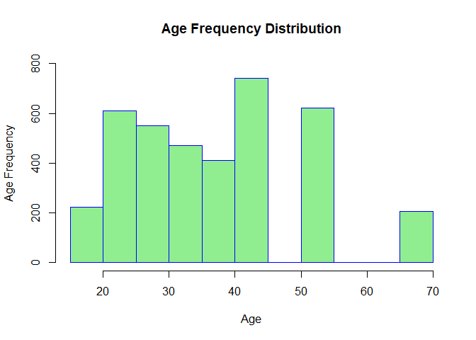
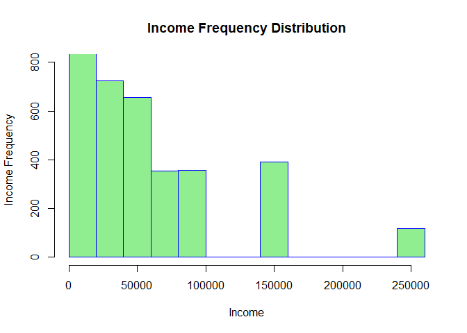
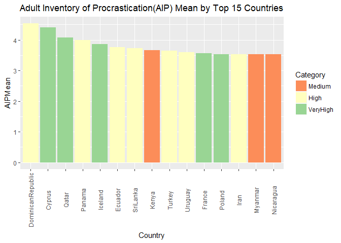
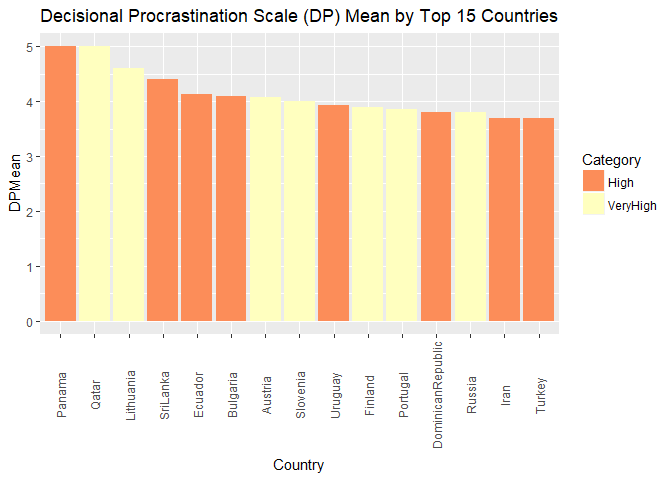
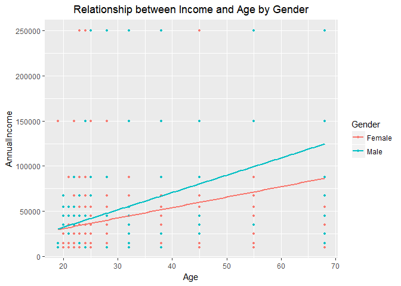
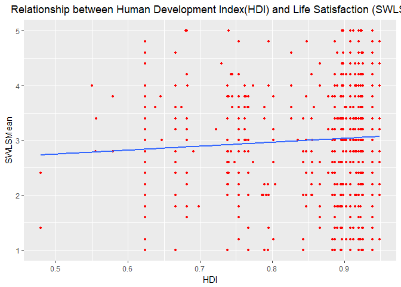
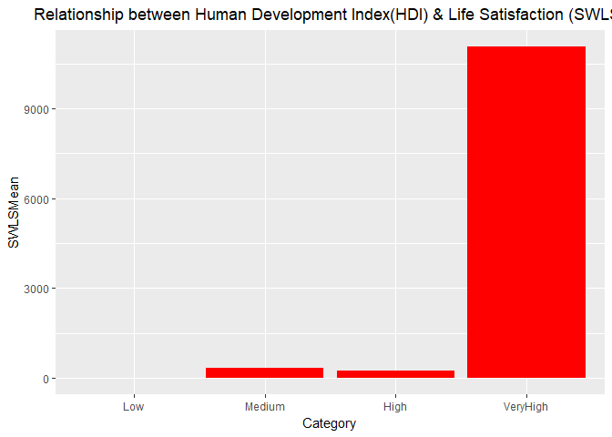

# Procrastination and Human Devlopment
Jim Park Asha Saxena Andrew Walch  
December 05, 2017  


# Background and Objective
## JAA Consultants LLC is pleased to provide this Procrastination and Human Devlopment report requesed by our client at the United Nations Development Program.   The purpose of this report is to provide a clean data set and prelimiary insights into the data for the United Nations.  The client has provided JAA with a procrastination data set including many individual observations from many countries.   At the core of this data is insight into four different procrastination tests given to the individuals.  JAA was then asked to combine Human Development Index data with the provided data set, then clean, provide some preliminary visuals, and a recommendation on how to proceed with a larger study to better understand the links between procrastination and Human Development.  Human Development Index (HDI), age and income may be used to evaluate the emphasis that people and their capabilities should be the ultimate criteria for assessing the development of a country, not economic growth alone. 

## This report is structured in the followin steps:  1.  Data Profiling, Consolidation, and Cleansing, 2. Data Scraping and Merging, 3. Data Screening and Initial Analysis/Visualization (with Output files), 4. Recommendations 

# Step 1: Data Profiling, Consolidation, and Cleansing
## In this step JAA has conducted preliminary data exploration fromt the data provided (procrastination.csv) by the United Nations.  The data provided consists of 4,264 individual observations and 61 variables, all of which are fully explained in the Codebook.csv file provided as specified, in Asha Saxena's Github account. Of particular interest are the Countries involved and the procrastination scores from four studies.  The studies were: 1. Decisional Procrastination (DP) scale, 2. Adult Inventory of Procrastination (AIP) Scale, 3. General Procrastination (GP) scale, and 4. Satisfaction with Life Scale (SWLS)

## The variables, or columns, were first renamed per specificaiton from the client and to simplify reading and working with the data.  Next the data was cleaned to remove non-sensical values, correct mis-spellings, numerical corrections, and a categorization of teaching and education related occupations of interest in future studies by the United Nations. To simplify the data and more quickly digest the DP, AIP, GP, and SWLS scores were represented as a mean for each.  Below is the associated code and ouptput necessary to visualize the state of the code.


```r
#2a Read the csv into R and take a look at the data set. Output how many rows and columns the data.frame is.
PD <- read.csv("Procrastination.csv")
dim(PD) #results in printing the number of rows then the number of columns.
```

```
## [1] 4264   61
```


```r
#2b The column names are either too much or not enough. Change the column names so that they do not have spaces, underscores, slashes, and the like. All column names should be under 12 characters. Make sure you’re updating your codebook with information on the tidied data set as well.

class(PD)
```

```
## [1] "data.frame"
```

```r
OldNames <- names(PD)
library(data.table)
PD.renamed <- setnames(PD, old=OldNames, new=c("Age", "Gender", "Kids", "Education","WorkStatus","AnnualIncome", "Occupation", "Years", "Months", "Community", "Country", "Status", "NumSon", "NumDaught", "DP1", "DP2","DP3","DP4","DP5","AIP1","AIP2","AIP3","AIP4","AIP5","AIP6","AIP7","AIP8","AIP9","AIP10","AIP11","AIP12","AIP13","AIP14","AIP15", "GP1", "GP2", "GP3", "GP4", "GP5", "GP6", "GP7", "GP8", "GP9", "GP10", "GP11", "GP12", "GP13", "GP14", "GP15", "GP16", "GP17", "GP18", "GP19", "GP20", "SWLS1", "SWLS2", "SWLS3", "SWLS4", "SWLS5","Q1Self","Q2Others"))
head(PD.renamed)
```

```
##    Age Gender     Kids Education WorkStatus AnnualIncome Occupation
## 1 67.5   Male Yes Kids        ma    retired        25000           
## 2 45.0   Male Yes Kids       deg  part-time        35000           
## 3 19.0 Female  No Kids       dip    student           NA           
## 4 37.5   Male Yes Kids        ma  full-time        45000           
## 5 28.0 Female  No Kids       deg  full-time        35000           
## 6 23.0 Female  No Kids       deg  full-time        15000           
##     Years Months  Community        Country   Status NumSon NumDaught DP1
## 1 9.0e+00      0 Large-City    El Salvador Divorced      0         5   3
## 2 1.5e-19      0    Village        Bolivia  Married   Male         1   3
## 3 0.0e+00      0 Large Town         Cyprus   Single      0         0   5
## 4 1.4e+01      0 Large Town Czech Republic  Married      0         1   3
## 5 1.0e+00      0    Village Czech Republic   Single      0         0   3
## 6 1.0e+00      0 Small Town Czech Republic   Single      0         0   3
##   DP2 DP3 DP4 DP5 AIP1 AIP2 AIP3 AIP4 AIP5 AIP6 AIP7 AIP8 AIP9 AIP10 AIP11
## 1   1   1   1   1    1    1    1    1    1    1    1    1    5     1     1
## 2   4   3   3   3    3    1    4    3    3    4    3    3    3     3     4
## 3   5   2   3   3    5    4    4    5    5    5    5    4    5     5     4
## 4   3   3   3   3    2    1    4    3    5    3    4    5    4     5     4
## 5   3   2   1   1    1    1    3    3    2    2    2    2    1     1     2
## 6   4   3   2   2    2    5    5    5    5    3    5    4    4     5     3
##   AIP12 AIP13 AIP14 AIP15 GP1 GP2 GP3 GP4 GP5 GP6 GP7 GP8 GP9 GP10 GP11
## 1     1     1     1     3   1   1   1   1   1   1   1   1   1    1    5
## 2     2     2     2     4   4   2   2   2   2   2   4   2   4    2    3
## 3     3     5     4     3   5   2   2   4   3   1   3   2   5    4    5
## 4     3     4     2     1   4   1   3   3   2   3   4   5   4    1    3
## 5     1     2     1     2   4   1   2   4   5   2   4   2   4    1    2
## 6     5     4     5     5   5   5   2   5   4   4   5   4   4    3    4
##   GP12 GP13 GP14 GP15 GP16 GP17 GP18 GP19 GP20 SWLS1 SWLS2 SWLS3 SWLS4
## 1    1    1    1    1    1    1    5    1    5     5     5     5     5
## 2    4    2    2    3    4    3    3    4    4     3     4     4     4
## 3    5    3    4    5    2    3    5    5    4     2     2     2     3
## 4    4    3    3    4    4    3    4    5    1     2     4     2     2
## 5    3    2    4    3    2    3    2    3    4     4     4     4     3
## 6    4    3    4    4    4    4    4    4    4     3     2     4     4
##   SWLS5 Q1Self Q2Others
## 1     5     no       no
## 2     3    yes      yes
## 3     4    yes      yes
## 4     2    yes      yes
## 5     4     no       no
## 6     3    yes      yes
```


```r
#2c. Some columns are, due to Qualtrics, malfunctioning. Prime examples are the following columns: “How long have you held this position?: Years”, Country of residence, Number of sons, and Current Occupation.

#i Some have impossible data values. Detail what you are doing to fix these columns in the raw data and why. It’s a judgment call for each, but explain why. For example, most people have not been doing anything for over 100 years. For the “Years” columns, round to the nearest integer.

#ii Somehow, “Number of sons” was labeled with Male (1) and Female (2). Change these incorrect labels back to integers.

#iii There are no “0” country of residences. Treat this as missing.

#iv Current Occupation has no “please specify” or “0.” Treat them as missing. Some jobs are quite similar. Use judgment calls to make overwrite them into the same category. It does not have to be 100% accurate, but right now “ESL Teacher” would not be counted as “teacher” if there were unique counts.

#2Ci. Fix impossible data values.  Round Age and Years to nearest integer (negative exponents will default to 0 due to this), Correct Years '999' entries and treat as missing(NA), and correct number of sons entries where Male = 1 sons, and Female =2 sons, Change 0 in "Country" to NA to indicate the data is missing, change "please specify" or "0" under Occupation to NA to indicate missing, and combine similar occupations into category of occupation.

PD.renamed$Age <- as.integer(round(PD.renamed$Age)) #rounds all Ages to the nearest integer and converts from numeric to integer.
PD.renamed$Years <- as.integer(round(PD.renamed$Years)) #rounds all Years to the nearest integer and converts from from numeric to integer.
PD.renamed$Years <- as.integer(gsub(999, NA, PD.renamed$Years)) #Removes 999 values and treats them as missing by indicating with an NA
PD.renamed$NumSon <- (gsub("Male", 1, PD.renamed$NumSon)) #subs a 1 where the word Male is listed in NumSon
PD.renamed$NumSon <- (gsub("Female", 2, PD.renamed$NumSon)) #subs a 2 where the word Female is listed in NumSon
PD.renamed$NumSon <- as.integer(PD.renamed$NumSon) #Converts NumSon to an integer.
PD.renamed$Country <- gsub(0, NA, PD.renamed$Country) #displays Country with 0 as missing data (NA)
PD.renamed$Country[PD.renamed$Country == ""] <- NA #replaces all non-entries with NA
PD.renamed$Occupation[PD.renamed$Occupation == 0] <- NA
PD.renamed$Occupation[PD.renamed$Occupation == "please specify"] <- NA
PD.renamed$Occupation[PD.renamed$Occupation == ""] <- NA
PD.renamed$Country[PD.renamed$Country == "Isreal"] <- "Israel" #Israel was mispelled.
PD.renamed$Q1Self[PD.renamed$Q1Self == ""] <- NA
PD.renamed$Q2Others <- as.character(PD.renamed$Q2Others)
PD.renamed$Q2Others[PD.renamed$Q2Others == ""] <- NA
PD.renamed$Q2Others[PD.renamed$Q2Others == "0"] <- NA
PD.renamed$Q2Others[PD.renamed$Q2Others == "4"] <- NA
PD.renamed$Q2Others <- as.factor(PD.renamed$Q2Others)
PD.renamed$Gender[PD.renamed$Gender == ""] <- NA
PD.renamed$Occupation<- gsub(" ", "", PD.renamed$Occupation)
#Replaces several descriptions with Educator.
d <- PD.renamed$Occupation
d[grepl("eacher", d, ignore.case=FALSE)] <- "Educator"
d[grepl("cademic", d, ignore.case=FALSE)] <- "Educator"
d[grepl("rofessor", d, ignore.case=FALSE)] <- "Educator"
d[grepl("ducator", d, ignore.case=FALSE)] <- "Educator"
d[grepl("ducation", d, ignore.case=FALSE)] <- "Educator"
PD.renamed$Occupation <- d
```


```r
#2e.  Each variable that starts with either DP, AIP, GP, or SWLS is an individual item on a scale. For example, DP 1 through DP 5 are five different questions on the Decision Procrastination Scale. I’ve reverse-scored them for you already, but you should create a new column for each of them with their mean. To clarify, you’ll need a DPMean column, an AIPMean column, a GPMean column, and a SWLSMean column. This represents the individual’s average decisional procrastination (DP), procrastination behavior (AIP), generalized procrastination (GP), and life satisfaction (SWLS).

PD.renamed$DPMean=rowMeans(PD.renamed[,15:19]) #Creates column for mean of all DP entries in observation.
PD.renamed$AIPMean=rowMeans(PD.renamed[,20:34]) #Creates column for mean of all AIP entries in observation.
PD.renamed$GPMean=rowMeans(PD.renamed[,35:54]) #Creates column for mean of all GP entries in observation.
PD.renamed$SWLSMean=rowMeans(PD.renamed[,55:59]) #Creates column for mean of all SWLS entries in observation.
PD.renamed[,62:65] <- round(PD.renamed[,62:65], digits = 3) #Round DP, AIP, GP, and SWLS means to 1 digit.
head(PD.renamed[,62:65])
```

```
##   DPMean AIPMean GPMean SWLSMean
## 1    1.4   1.400   1.60      5.0
## 2    3.2   2.933   2.90      3.6
## 3    3.6   4.400   3.60      2.6
## 4    3.0   3.333   3.20      2.4
## 5    2.0   1.733   2.85      3.8
## 6    2.8   4.333   4.00      3.2
```

# Step 2:  Data Scraping and Merging
## In order to compare country procrastination data to HDI, JAA then proceeded to scrape the HDI data from the website specified by the client (https://en.wikipedia.org/wiki/List_of_countries_by_Human_Development_Index#Complete_list_of_countries), which provided the HDI by country and a categorization based on the HDI value.  Below is the associated code, scraped country and ordered HDI table. 


```r
##3 SCRAPING
#3a Scraped Country and HDI
options(digits=3)
library('rvest') # grab and parse HTML
```

```
## Loading required package: xml2
```

```r
#Specifying the url for desired website to be scrapped
url <- 'https://en.wikipedia.org/wiki/List_of_countries_by_Human_Development_Index#Complete_list_of_countries'

webpage <- read_html(url)#Reading the HTML code from the website

#Using XPath selectors to scrap the Country and HDI of first 8 tables
Country<-webpage%>%html_nodes("h3+ div .wikitable:nth-child(1) td:nth-child(3)")%>%html_text()
TempHDI<-webpage%>%html_nodes("h3+ div td:nth-child(4)")%>%html_text()
HDI <- as.numeric(TempHDI)
HDI
```

```
##   [1] 0.949 0.939 0.939 0.926 0.925 0.925 0.924 0.923 0.921 0.920 0.920
##  [12] 0.917 0.915 0.913 0.912 0.909 0.903 0.901 0.899 0.898 0.897 0.896
##  [23] 0.895 0.893 0.890 0.887 0.884 0.878 0.866 0.865 0.865 0.858 0.856
##  [34] 0.856 0.856 0.855 0.848 0.847 0.847 0.845 0.843 0.840 0.836 0.830
##  [45] 0.827 0.827 0.824 0.807 0.804 0.802 0.800 0.796 0.796 0.795 0.795
##  [56] 0.794 0.794 0.792 0.789 0.788 0.788 0.786 0.782 0.781 0.780 0.776
##  [67] 0.776 0.775 0.774 0.769 0.767 0.767 0.766 0.765 0.764 0.763 0.762
##  [78] 0.759 0.754 0.754 0.750 0.748 0.745 0.743 0.743 0.741 0.740 0.740
##  [89] 0.739 0.738 0.736 0.735 0.735 0.730 0.727 0.726 0.725 0.725 0.722
## [100] 0.722 0.721 0.717 0.716 0.706 0.704 0.701 0.701 0.699 0.698 0.697
## [111] 0.693 0.691 0.691 0.689 0.684 0.683 0.682 0.680 0.674 0.666 0.664
## [122] 0.649 0.648 0.647 0.645 0.640 0.640 0.638 0.638 0.627 0.625 0.624
## [133] 0.607 0.605 0.597 0.592 0.592 0.588 0.586 0.579 0.579 0.579 0.574
## [144] 0.563 0.558 0.556 0.555 0.550 0.541 0.536 0.533 0.531 0.527 0.518
## [155] 0.516 0.516 0.515 0.513 0.512 0.498 0.497 0.497 0.494 0.493 0.493
## [166] 0.490 0.487 0.485 0.482 0.479 0.476 0.474 0.473 0.452 0.448 0.442
## [177] 0.435 0.427 0.424 0.420 0.420 0.418 0.418 0.414 0.404 0.402 0.396
## [188] 0.353 0.352
```

```r
CountryHDI <- data.frame(Country, HDI)#Convert to data frame.
CountryHDI$HDI <- as.character(CountryHDI$HDI) #),digits=3) #Changes to numeric so we can later categorize
CountryHDI$HDI <- as.numeric(CountryHDI$HDI)
CountryHDI$Country <- as.character(CountryHDI$Country)
CountryHDI
```

```
##                                Country   HDI
## 1                               Norway 0.949
## 2                            Australia 0.939
## 3                          Switzerland 0.939
## 4                              Germany 0.926
## 5                              Denmark 0.925
## 6                            Singapore 0.925
## 7                          Netherlands 0.924
## 8                              Ireland 0.923
## 9                              Iceland 0.921
## 10                              Canada 0.920
## 11                       United States 0.920
## 12                           Hong Kong 0.917
## 13                         New Zealand 0.915
## 14                              Sweden 0.913
## 15                       Liechtenstein 0.912
## 16                      United Kingdom 0.909
## 17                               Japan 0.903
## 18                         South Korea 0.901
## 19                              Israel 0.899
## 20                          Luxembourg 0.898
## 21                              France 0.897
## 22                             Belgium 0.896
## 23                             Finland 0.895
## 24                             Austria 0.893
## 25                            Slovenia 0.890
## 26                               Italy 0.887
## 27                               Spain 0.884
## 28                      Czech Republic 0.878
## 29                              Greece 0.866
## 30                              Brunei 0.865
## 31                             Estonia 0.865
## 32                             Andorra 0.858
## 33                              Cyprus 0.856
## 34                               Malta 0.856
## 35                               Qatar 0.856
## 36                              Poland 0.855
## 37                           Lithuania 0.848
## 38                               Chile 0.847
## 39                        Saudi Arabia 0.847
## 40                            Slovakia 0.845
## 41                            Portugal 0.843
## 42                United Arab Emirates 0.840
## 43                             Hungary 0.836
## 44                              Latvia 0.830
## 45                           Argentina 0.827
## 46                             Croatia 0.827
## 47                             Bahrain 0.824
## 48                          Montenegro 0.807
## 49                              Russia 0.804
## 50                             Romania 0.802
## 51                              Kuwait 0.800
## 52                             Belarus 0.796
## 53                                Oman 0.796
## 54                            Barbados 0.795
## 55                             Uruguay 0.795
## 56                            Bulgaria 0.794
## 57                          Kazakhstan 0.794
## 58                             Bahamas 0.792
## 59                            Malaysia 0.789
## 60                               Palau 0.788
## 61                              Panama 0.788
## 62                 Antigua and Barbuda 0.786
## 63                          Seychelles 0.782
## 64                           Mauritius 0.781
## 65                 Trinidad and Tobago 0.780
## 66                          Costa Rica 0.776
## 67                              Serbia 0.776
## 68                                Cuba 0.775
## 69                                Iran 0.774
## 70                             Georgia 0.769
## 71                              Turkey 0.767
## 72                           Venezuela 0.767
## 73                           Sri Lanka 0.766
## 74               Saint Kitts and Nevis 0.765
## 75                             Albania 0.764
## 76                             Lebanon 0.763
## 77                              Mexico 0.762
## 78                          Azerbaijan 0.759
## 79                              Brazil 0.754
## 80                             Grenada 0.754
## 81              Bosnia and Herzegovina 0.750
## 82                           Macedonia 0.748
## 83                             Algeria 0.745
## 84                             Armenia 0.743
## 85                             Ukraine 0.743
## 86                              Jordan 0.741
## 87                                Peru 0.740
## 88                            Thailand 0.740
## 89                             Ecuador 0.739
## 90                               China 0.738
## 91                                Fiji 0.736
## 92                            Mongolia 0.735
## 93                         Saint Lucia 0.735
## 94                             Jamaica 0.730
## 95                            Colombia 0.727
## 96                            Dominica 0.726
## 97                            Suriname 0.725
## 98                             Tunisia 0.725
## 99                  Dominican Republic 0.722
## 100   Saint Vincent and the Grenadines 0.722
## 101                              Tonga 0.721
## 102                              World 0.717
## 103                              Libya 0.716
## 104                             Belize 0.706
## 105                              Samoa 0.704
## 106                           Maldives 0.701
## 107                         Uzbekistan 0.701
## 108                            Moldova 0.699
## 109                           Botswana 0.698
## 110                              Gabon 0.697
## 111                           Paraguay 0.693
## 112                              Egypt 0.691
## 113                       Turkmenistan 0.691
## 114                          Indonesia 0.689
## 115                          Palestine 0.684
## 116                            Vietnam 0.683
## 117                        Philippines 0.682
## 118                        El Salvador 0.680
## 119                            Bolivia 0.674
## 120                       South Africa 0.666
## 121                         Kyrgyzstan 0.664
## 122                               Iraq 0.649
## 123                         Cape Verde 0.648
## 124                            Morocco 0.647
## 125                          Nicaragua 0.645
## 126                          Guatemala 0.640
## 127                            Namibia 0.640
## 128                             Guyana 0.638
## 129                         Micronesia 0.638
## 130                         Tajikistan 0.627
## 131                           Honduras 0.625
## 132                              India 0.624
## 133                             Bhutan 0.607
## 134                        Timor Leste 0.605
## 135                            Vanuatu 0.597
## 136             Congo, Republic of the 0.592
## 137                  Equatorial Guinea 0.592
## 138                           Kiribati 0.588
## 139                               Laos 0.586
## 140                         Bangladesh 0.579
## 141                              Ghana 0.579
## 142                             Zambia 0.579
## 143              São Tomé and Príncipe 0.574
## 144                           Cambodia 0.563
## 145                              Nepal 0.558
## 146                            Myanmar 0.556
## 147                              Kenya 0.555
## 148                           Pakistan 0.550
## 149                          Swaziland 0.541
## 150                              Syria 0.536
## 151                             Angola 0.533
## 152                           Tanzania 0.531
## 153                            Nigeria 0.527
## 154                           Cameroon 0.518
## 155                   Papua New Guinea 0.516
## 156                           Zimbabwe 0.516
## 157                    Solomon Islands 0.515
## 158                         Mauritania 0.513
## 159                         Madagascar 0.512
## 160                             Rwanda 0.498
## 161                            Comoros 0.497
## 162                            Lesotho 0.497
## 163                            Senegal 0.494
## 164                              Haiti 0.493
## 165                             Uganda 0.493
## 166                              Sudan 0.490
## 167                               Togo 0.487
## 168                              Benin 0.485
## 169                              Yemen 0.482
## 170                        Afghanistan 0.479
## 171                             Malawi 0.476
## 172                      Côte d'Ivoire 0.474
## 173                           Djibouti 0.473
## 174                             Gambia 0.452
## 175                           Ethiopia 0.448
## 176                               Mali 0.442
## 177  Congo, Democratic Republic of the 0.435
## 178                            Liberia 0.427
## 179                      Guinea Bissau 0.424
## 180                            Eritrea 0.420
## 181                       Sierra Leone 0.420
## 182                         Mozambique 0.418
## 183                        South Sudan 0.418
## 184                             Guinea 0.414
## 185                            Burundi 0.404
## 186                       Burkina Faso 0.402
## 187                               Chad 0.396
## 188                              Niger 0.353
## 189           Central African Republic 0.352
```

## A minor adjustment was added to the table at the request of the client to add the HDI category as specified in the website.  The code and table is shown below.

```r
#3b. Create a new column for this final scraped table which categories the Countries like the original page (Very high human development, High human development, Medium human development, Low human development). After these categories, output a csv file of this table to your repository.

CountryHDI$Category <- cut(CountryHDI$HDI, 
                       breaks = c(0, 0.55, 0.7, 0.8, 1.0), 
                       labels = c("Low", "Medium", "High", "VeryHigh"), 
                       right = FALSE)
CountryHDI
```

```
##                                Country   HDI Category
## 1                               Norway 0.949 VeryHigh
## 2                            Australia 0.939 VeryHigh
## 3                          Switzerland 0.939 VeryHigh
## 4                              Germany 0.926 VeryHigh
## 5                              Denmark 0.925 VeryHigh
## 6                            Singapore 0.925 VeryHigh
## 7                          Netherlands 0.924 VeryHigh
## 8                              Ireland 0.923 VeryHigh
## 9                              Iceland 0.921 VeryHigh
## 10                              Canada 0.920 VeryHigh
## 11                       United States 0.920 VeryHigh
## 12                           Hong Kong 0.917 VeryHigh
## 13                         New Zealand 0.915 VeryHigh
## 14                              Sweden 0.913 VeryHigh
## 15                       Liechtenstein 0.912 VeryHigh
## 16                      United Kingdom 0.909 VeryHigh
## 17                               Japan 0.903 VeryHigh
## 18                         South Korea 0.901 VeryHigh
## 19                              Israel 0.899 VeryHigh
## 20                          Luxembourg 0.898 VeryHigh
## 21                              France 0.897 VeryHigh
## 22                             Belgium 0.896 VeryHigh
## 23                             Finland 0.895 VeryHigh
## 24                             Austria 0.893 VeryHigh
## 25                            Slovenia 0.890 VeryHigh
## 26                               Italy 0.887 VeryHigh
## 27                               Spain 0.884 VeryHigh
## 28                      Czech Republic 0.878 VeryHigh
## 29                              Greece 0.866 VeryHigh
## 30                              Brunei 0.865 VeryHigh
## 31                             Estonia 0.865 VeryHigh
## 32                             Andorra 0.858 VeryHigh
## 33                              Cyprus 0.856 VeryHigh
## 34                               Malta 0.856 VeryHigh
## 35                               Qatar 0.856 VeryHigh
## 36                              Poland 0.855 VeryHigh
## 37                           Lithuania 0.848 VeryHigh
## 38                               Chile 0.847 VeryHigh
## 39                        Saudi Arabia 0.847 VeryHigh
## 40                            Slovakia 0.845 VeryHigh
## 41                            Portugal 0.843 VeryHigh
## 42                United Arab Emirates 0.840 VeryHigh
## 43                             Hungary 0.836 VeryHigh
## 44                              Latvia 0.830 VeryHigh
## 45                           Argentina 0.827 VeryHigh
## 46                             Croatia 0.827 VeryHigh
## 47                             Bahrain 0.824 VeryHigh
## 48                          Montenegro 0.807 VeryHigh
## 49                              Russia 0.804 VeryHigh
## 50                             Romania 0.802 VeryHigh
## 51                              Kuwait 0.800 VeryHigh
## 52                             Belarus 0.796     High
## 53                                Oman 0.796     High
## 54                            Barbados 0.795     High
## 55                             Uruguay 0.795     High
## 56                            Bulgaria 0.794     High
## 57                          Kazakhstan 0.794     High
## 58                             Bahamas 0.792     High
## 59                            Malaysia 0.789     High
## 60                               Palau 0.788     High
## 61                              Panama 0.788     High
## 62                 Antigua and Barbuda 0.786     High
## 63                          Seychelles 0.782     High
## 64                           Mauritius 0.781     High
## 65                 Trinidad and Tobago 0.780     High
## 66                          Costa Rica 0.776     High
## 67                              Serbia 0.776     High
## 68                                Cuba 0.775     High
## 69                                Iran 0.774     High
## 70                             Georgia 0.769     High
## 71                              Turkey 0.767     High
## 72                           Venezuela 0.767     High
## 73                           Sri Lanka 0.766     High
## 74               Saint Kitts and Nevis 0.765     High
## 75                             Albania 0.764     High
## 76                             Lebanon 0.763     High
## 77                              Mexico 0.762     High
## 78                          Azerbaijan 0.759     High
## 79                              Brazil 0.754     High
## 80                             Grenada 0.754     High
## 81              Bosnia and Herzegovina 0.750     High
## 82                           Macedonia 0.748     High
## 83                             Algeria 0.745     High
## 84                             Armenia 0.743     High
## 85                             Ukraine 0.743     High
## 86                              Jordan 0.741     High
## 87                                Peru 0.740     High
## 88                            Thailand 0.740     High
## 89                             Ecuador 0.739     High
## 90                               China 0.738     High
## 91                                Fiji 0.736     High
## 92                            Mongolia 0.735     High
## 93                         Saint Lucia 0.735     High
## 94                             Jamaica 0.730     High
## 95                            Colombia 0.727     High
## 96                            Dominica 0.726     High
## 97                            Suriname 0.725     High
## 98                             Tunisia 0.725     High
## 99                  Dominican Republic 0.722     High
## 100   Saint Vincent and the Grenadines 0.722     High
## 101                              Tonga 0.721     High
## 102                              World 0.717     High
## 103                              Libya 0.716     High
## 104                             Belize 0.706     High
## 105                              Samoa 0.704     High
## 106                           Maldives 0.701     High
## 107                         Uzbekistan 0.701     High
## 108                            Moldova 0.699   Medium
## 109                           Botswana 0.698   Medium
## 110                              Gabon 0.697   Medium
## 111                           Paraguay 0.693   Medium
## 112                              Egypt 0.691   Medium
## 113                       Turkmenistan 0.691   Medium
## 114                          Indonesia 0.689   Medium
## 115                          Palestine 0.684   Medium
## 116                            Vietnam 0.683   Medium
## 117                        Philippines 0.682   Medium
## 118                        El Salvador 0.680   Medium
## 119                            Bolivia 0.674   Medium
## 120                       South Africa 0.666   Medium
## 121                         Kyrgyzstan 0.664   Medium
## 122                               Iraq 0.649   Medium
## 123                         Cape Verde 0.648   Medium
## 124                            Morocco 0.647   Medium
## 125                          Nicaragua 0.645   Medium
## 126                          Guatemala 0.640   Medium
## 127                            Namibia 0.640   Medium
## 128                             Guyana 0.638   Medium
## 129                         Micronesia 0.638   Medium
## 130                         Tajikistan 0.627   Medium
## 131                           Honduras 0.625   Medium
## 132                              India 0.624   Medium
## 133                             Bhutan 0.607   Medium
## 134                        Timor Leste 0.605   Medium
## 135                            Vanuatu 0.597   Medium
## 136             Congo, Republic of the 0.592   Medium
## 137                  Equatorial Guinea 0.592   Medium
## 138                           Kiribati 0.588   Medium
## 139                               Laos 0.586   Medium
## 140                         Bangladesh 0.579   Medium
## 141                              Ghana 0.579   Medium
## 142                             Zambia 0.579   Medium
## 143              São Tomé and Príncipe 0.574   Medium
## 144                           Cambodia 0.563   Medium
## 145                              Nepal 0.558   Medium
## 146                            Myanmar 0.556   Medium
## 147                              Kenya 0.555   Medium
## 148                           Pakistan 0.550   Medium
## 149                          Swaziland 0.541      Low
## 150                              Syria 0.536      Low
## 151                             Angola 0.533      Low
## 152                           Tanzania 0.531      Low
## 153                            Nigeria 0.527      Low
## 154                           Cameroon 0.518      Low
## 155                   Papua New Guinea 0.516      Low
## 156                           Zimbabwe 0.516      Low
## 157                    Solomon Islands 0.515      Low
## 158                         Mauritania 0.513      Low
## 159                         Madagascar 0.512      Low
## 160                             Rwanda 0.498      Low
## 161                            Comoros 0.497      Low
## 162                            Lesotho 0.497      Low
## 163                            Senegal 0.494      Low
## 164                              Haiti 0.493      Low
## 165                             Uganda 0.493      Low
## 166                              Sudan 0.490      Low
## 167                               Togo 0.487      Low
## 168                              Benin 0.485      Low
## 169                              Yemen 0.482      Low
## 170                        Afghanistan 0.479      Low
## 171                             Malawi 0.476      Low
## 172                      Côte d'Ivoire 0.474      Low
## 173                           Djibouti 0.473      Low
## 174                             Gambia 0.452      Low
## 175                           Ethiopia 0.448      Low
## 176                               Mali 0.442      Low
## 177  Congo, Democratic Republic of the 0.435      Low
## 178                            Liberia 0.427      Low
## 179                      Guinea Bissau 0.424      Low
## 180                            Eritrea 0.420      Low
## 181                       Sierra Leone 0.420      Low
## 182                         Mozambique 0.418      Low
## 183                        South Sudan 0.418      Low
## 184                             Guinea 0.414      Low
## 185                            Burundi 0.404      Low
## 186                       Burkina Faso 0.402      Low
## 187                               Chad 0.396      Low
## 188                              Niger 0.353      Low
## 189           Central African Republic 0.352      Low
```

```r
write.csv(CountryHDI, file = "CountryHDI.csv") #Creates csv file
```

# Step 3: Data Screening and Initial Analysis/Visualization
## Next the data was merged in order to combinie the two data sets so that Data Screening and Initial Analysis/Visualization may be conducted.  Below is the merge code and also minor data cleaning so that the data could be merged based on the country variable in both data sets.


```r
#3c Merge this data frame to the Country of Residence column of Procrastination.csv so that your data now has an HDI column and HDI categories (Very high human development, etc.).

CountryHDI$Country <- gsub(" ", "", CountryHDI$Country, fixed = TRUE) #Removes extra spaces that area not needed.
CountryHDI$Country <- gsub("(^\\s+)|(\\s+$)", "", CountryHDI$Country) #Removes extra spaces that area not needed.
PD.renamed$Country <- gsub("(^\\s+)|(\\s+$)", "", PD.renamed$Country) #Removes extra spaces that area not needed.
PD.renamed$Country <- gsub(" ", "", PD.renamed$Country, fixed = TRUE) #Removes extra spaces that area not needed.
CountryHDI$Country[CountryHDI$Country == "AntiguaandBarbuda"] <- "Antigua"
MergedData <- merge(CountryHDI, PD.renamed, by=c('Country'))
head(MergedData)
```

```
##       Country   HDI Category Age Gender     Kids Education WorkStatus
## 1 Afghanistan 0.479      Low  55   Male  No Kids       deg  full-time
## 2 Afghanistan 0.479      Low  55 Female Yes Kids       deg  full-time
## 3 Afghanistan 0.479      Low  80 Female  No Kids     grade unemployed
## 4 Afghanistan 0.479      Low  55   Male Yes Kids        ma  full-time
## 5     Albania 0.764     High  45 Female  No Kids     ltuni  full-time
## 6     Albania 0.764     High  68   Male Yes Kids       deg  part-time
##   AnnualIncome      Occupation Years Months    Community   Status NumSon
## 1        87500            <NA>     0      6   Large Town  Married      0
## 2        10000            <NA>     7      0      Village Divorced      4
## 3        10000            <NA>     0      0 Medium-Sized   Single      0
## 4       150000            <NA>     0      0   Large Town  Married      4
## 5       150000            <NA>     0      0   Large Town   Single      0
## 6        87500 MediaConsultant     4      0   Large-City Divorced      0
##   NumDaught DP1 DP2 DP3 DP4 DP5 AIP1 AIP2 AIP3 AIP4 AIP5 AIP6 AIP7 AIP8
## 1         0   3   3   3   4   3    3    2    2    2    3    2    3    3
## 2         0   4   3   4   3   2    1    2    1    4    3    5    4    4
## 3         0   2   3   2   3   5    2    2    3    4    2    2    2    1
## 4         2   4   4   4   3   3    3    4    5    4    3    4    3    5
## 5         0   3   3   5   3   3    3    1    2    1    2    2    2    2
## 6         2   4   3   2   2   1    4    1    5    1    2    1    1    3
##   AIP9 AIP10 AIP11 AIP12 AIP13 AIP14 AIP15 GP1 GP2 GP3 GP4 GP5 GP6 GP7 GP8
## 1    2     3     4     2     4     2     3   4   2   4   3   3   3   3   4
## 2    3     3     3     4     3     3     3   3   2   2   5   3   3   3   5
## 3    1     3     5     4     3     3     4   4   4   1   4   4   4   4   3
## 4    4     3     5     5     1     5     4   4   4   5   3   1   3   4   4
## 5    1     2     3     2     2     1     5   5   3   2   2   5   4   5   5
## 6    2     3     3     1     3     1     5   4   1   2   2   3   2   2   2
##   GP9 GP10 GP11 GP12 GP13 GP14 GP15 GP16 GP17 GP18 GP19 GP20 SWLS1 SWLS2
## 1   4    2    2    3    2    4    3    4    3    3    4    4     3     2
## 2   3    1    2    3    1    1    3    3    3    4    3    3     1     1
## 3   2    2    3    3    2    3    2    4    4    4    3    4     2     4
## 4   4    4    4    4    3    4    4    4    4    4    3    4     3     3
## 5   5    1    3    4    5    5    5    4    3    4    4    4     3     3
## 6   4    1    2    4    4    4    4    4    4    3    4    4     3     4
##   SWLS3 SWLS4 SWLS5 Q1Self Q2Others DPMean AIPMean GPMean SWLSMean
## 1     2     3     2    yes       no    3.2    2.67    3.2      2.4
## 2     1     3     1     no      yes    3.2    3.07    2.8      1.4
## 3     3     3     2    yes       no    3.0    2.73    3.2      2.8
## 4     2     2     2    yes      yes    3.6    3.87    3.7      2.4
## 5     3     4     2    yes       no    3.4    2.07    3.9      3.0
## 6     3     5     4    yes       no    2.4    2.40    3.0      3.8
```

## During this step unique country names were discovered.  Several were listed as "NA" indicating that the country was simply not provided, or missing, in the data.   There were seveal country names that were either not in the Procrastination set, Not listed (NA) or associated with another country (ie Taiwan/China).  This was merely a tool to confirm a valid data merge and may be seen below with the output of exceptions. 


```r
#Code to identify country mismatches after merge including NA's.

library('plyr') # to call the count command

'%nin%' <- Negate('%in%')
pu <- unique(PD.renamed$Country)
hu <- unique(CountryHDI$Country)
a<- pu[pu %nin% hu]  #Finds unique Countries in the procrastination data set that are not in the HDI dataset. These are the ones that could not be matched up. 
a
```

```
## [1] "Guam"       "PuertoRico" "Bermuda"    "Taiwan"     "Macao"     
## [6] "Yugoslavia" "Columbia"   NA
```


## Prior to further anlysis the data was filtered, per client direction, to remove 18 and under observations as well as elderly outliers 80 and above.  The code and age frequency tables (before and after) is shown below.


```r
#4a Remove all observations where the participant is under age 18. No further analysis of underage individuals is permitted by your client. Remove any other age outliers as you see fit, but be sure to tell what you’re doing and why.

##REMOVED AGE = 80 (OUTLIER) BELOW.

MergedData.filt <- subset(MergedData, Age > 18)
MergedData.filt.b <- subset(MergedData.filt, Age != 80)
library('dplyr') # to call the count command
```

```
## 
## Attaching package: 'dplyr'
```

```
## The following objects are masked from 'package:plyr':
## 
##     arrange, count, desc, failwith, id, mutate, rename, summarise,
##     summarize
```

```
## The following objects are masked from 'package:data.table':
## 
##     between, first, last
```

```
## The following objects are masked from 'package:stats':
## 
##     filter, lag
```

```
## The following objects are masked from 'package:base':
## 
##     intersect, setdiff, setequal, union
```

```r
AgeFreq.noEighty <- count(MergedData.filt, Age)
AgeFreq.noEighty
```

```
## # A tibble: 14 x 2
##      Age     n
##    <int> <int>
##  1    19   107
##  2    20   117
##  3    21   117
##  4    22   122
##  5    23   118
##  6    24   119
##  7    25   134
##  8    28   551
##  9    32   472
## 10    38   410
## 11    45   741
## 12    55   623
## 13    68   207
## 14    80    26
```

```r
AgeFreq<- count(MergedData.filt.b, Age) #Generates frequency table.  
AgeFreq #Verifies under 18 and 80 outlier is removed.
```

```
## # A tibble: 13 x 2
##      Age     n
##    <int> <int>
##  1    19   107
##  2    20   117
##  3    21   117
##  4    22   122
##  5    23   118
##  6    24   119
##  7    25   134
##  8    28   551
##  9    32   472
## 10    38   410
## 11    45   741
## 12    55   623
## 13    68   207
```

## Exploratory analysis continued with a high-level descriptive statistics table as specified by the client for Age, Income, HDI, and the four procrastination metrics (DP, AIP, GP, and SWLS).  In addition frequency graphs (histograms) were provided for age and income in order to begin to understand the observation sample demographics. 


```r
#4b. Please provide (in pretty-fied table format or similar), descriptive statistics on Age, Income, HDI, and the four mean columns (DP, etc.). Create a simple histogram for two of these seven variables. Comment on the shape of the distribution in your markdown.

library(pastecs)
```

```
## Warning: package 'pastecs' was built under R version 3.4.3
```

```
## Loading required package: boot
```

```
## 
## Attaching package: 'pastecs'
```

```
## The following objects are masked from 'package:dplyr':
## 
##     first, last
```

```
## The following objects are masked from 'package:data.table':
## 
##     first, last
```

```r
dfTemp <- MergedData.filt.b
attach(dfTemp)
```

```
## The following objects are masked _by_ .GlobalEnv:
## 
##     Country, HDI
```

```r
dfTemp <- cbind(Age, AnnualIncome, as.double(HDI), DP1, AIP1, GP1, SWLS1)
```

```
## Warning in cbind(Age, AnnualIncome, as.double(HDI), DP1, AIP1, GP1, SWLS1):
## number of rows of result is not a multiple of vector length (arg 3)
```

```r
colnames(dfTemp) <- c("Age", "AnnualIncome", "HDI", "DPMean", "AIPMean","GPMean", "SWLSMean")
options(scipen=100)
options(digits=0)
#stat.desc(dfTemp, basic=F)
stat.desc(dfTemp) #Provides statistical data.
```

```
##                 Age AnnualIncome  HDI DPMean AIPMean GPMean SWLSMean
## nbr.val        3838         3492 3838   3838    3838   3838     3838
## nbr.null          0            0    0      0       0      0        0
## nbr.na            0          346    0      0       0      0        0
## min              19        10000    0      1       1      1        1
## max              68       250000    1      5       5      5        5
## range            49       240000    1      4       4      4        4
## sum          146232    207785000 2692  12988    7850  14104    11316
## median           38        45000    1      3       2      4        3
## mean             38        59503    1      3       2      4        3
## SE.mean           0          931    0      0       0      0        0
## CI.mean.0.95      0         1825    0      0       0      0        0
## var             180   3025272262    0      1       1      1        1
## std.dev          13        55002    0      1       1      1        1
## coef.var          0            1    0      0       1      0        0
```

```r
dfTemp <- cbind(Age, AnnualIncome)
dfTemp <- data.frame(dfTemp)


hist(dfTemp$Age, ylim = c(0,800), main="Age Frequency Distribution", 
     xlab="Age", border="blue", ylab = "Age Frequency", col="lightgreen") 
```

<!-- -->

```r
# Age distribution is skewed right with the bulk of the age between 20 and 45.

hist(dfTemp$AnnualIncome, ylim = c(0,800), main="Income Frequency Distribution", 
     xlab="Income", border="blue", ylab = "Income Frequency", col="lightgreen") 
```

<!-- -->

```r
# Income distribution is skewed right with the bulk of the income between 0 and 100,000.
detach(dfTemp)
```

## Next JAA determined additional demographic data specific to Gender count, Work Status, and Occupation.   This information could be useful in specifying further analysis and studies. 


```r
#4c. Give the frequencies (in table format or similar) for Gender, Work Status, and Occupation. They can be separate tables, if that’s your choice.

library('dplyr') # to call the count command
GenderCount <- count(MergedData.filt.b, Gender)
WorkStatusCount <- count(MergedData.filt.b, WorkStatus)
OccupationCount <- count(MergedData.filt.b, Occupation)
GenderCount
```

```
## # A tibble: 3 x 2
##   Gender     n
##   <fctr> <int>
## 1 Female  2191
## 2   Male  1642
## 3   <NA>     5
```

```r
WorkStatusCount
```

```
## # A tibble: 6 x 2
##   WorkStatus     n
##       <fctr> <int>
## 1               24
## 2  full-time  2196
## 3  part-time   451
## 4    retired   141
## 5    student   787
## 6 unemployed   239
```

```r
OccupationCount
```

```
## # A tibble: 617 x 2
##                             Occupation     n
##                                  <chr> <int>
##  1 'Utterlyshiftlessartsstudent'...atp     1
##  2                                 abc     1
##  3                          Accountant     2
##  4                          Accounting     2
##  5                 AccountingAssistant     1
##  6                   AccountingManager     2
##  7                      AccountManager     1
##  8                      accountplanner     1
##  9                   AccountServiceRep     1
## 10                     AccountsPayable     1
## # ... with 607 more rows
```
## Since the data may be influenced by a particular countries culture JAA has also provided a frequency count of observations, or participants in this study, by country.  As one can see, the United States is heavily represented in this study.


```r
#4d. Give the counts (again, pretty table) of how many participants per country in descending order.
library(dplyr)
dfTempCounts <- MergedData.filt.b
attach(dfTempCounts)
```

```
## The following objects are masked _by_ .GlobalEnv:
## 
##     Country, HDI
```

```r
 dfTempCounts %>% select(Country) %>% group_by(Country) %>% 
  dplyr::summarise(Participant_Count = n()) %>% 
  plyr::arrange(desc(Participant_Count))
```

```
## # A tibble: 81 x 2
##          Country Participant_Count
##            <chr>             <int>
##  1  UnitedStates              2767
##  2        Canada               243
##  3 UnitedKingdom               177
##  4     Australia                99
##  5         India                78
##  6         Italy                60
##  7       Germany                36
##  8        Brazil                20
##  9       Ireland                19
## 10        Israel                19
## # ... with 71 more rows
```

## The United Nations also asked JAA to determine how well individuals self-perceived their own procrastination by asking two question relating to their view and the view others.   When a person perceives themselves as being a procrastinator there is generally agreement based on the table below.   Whena  person does perceives themselves as being a procrastinator there is generally dis-agreement with others.  


```r
#4e. There are two variables in the set: whether the person considers themselves a procrastinator (yes/no) and whether others consider them a procrastinator (yes/no). How many people matched their perceptions to others’ (so, yes/yes and no/no)? To clarify: how many people said they felt they were procrastinators and also said others thought they were procrastinators? Likewise, how many said they were not procrastinators and others also did not think they were procrastinators?

  x <- MergedData.filt.b %>% select(Q1Self, Q2Others)
  x$Q1Self <- as.character(x$Q1Self)#self Responce
  x$Q2Others <- as.character(x$Q2Others)#other views
  
  x %>% select(Q1Self,Q2Others) %>% ungroup() %>%#ungroup responces
  filter(base::nchar(Q1Self)>0 & base::nchar(Q2Others)>0) %>% #filters Q1self and Q2Others responces
  filter(Q1Self==Q2Others) %>% group_by(Q1Self) %>% #compares Q1 abd Q2 to eachother
  dplyr::summarise(InAgreement_Count = n()) %>% 
  rename(InAgreement = Q1Self)
```

```
## # A tibble: 2 x 2
##   InAgreement InAgreement_Count
##         <chr>             <int>
## 1          no               451
## 2         yes              2255
```

## The next two barcharts show that many of the same countries are represented as exhibiting the highest level of procrastination by either the AIP or DP scale.   This tells us that there may be culteral or HDI links. 


```r
#5b. Create a barchart in ggplot or similar which displays the top 15 nations in average procrastination scores, using one measure of the following: DP, AIP, or GP. The bars should be in descending order, with the number 1 most procrastinating nation at the top and 15th most procrastinating at the bottom. Omit all other nations. Color the bars by HDI category (see 3B). Use any color palette of your choice other than the default.
library(ggplot2)
library(RColorBrewer)
library(dplyr)
ByCountry<- group_by(MergedData.filt.b, MergedData.filt.b$Country) #Organizes by country
CountryAIPMean <- summarize(ByCountry,CAIPMean = mean(AIPMean)) # Summarizes by country and finds mean of AIP means of all observations, then assigns to dataframe
CountryAIPMean <- rename(CountryAIPMean, 'Country' = 'MergedData.filt.b$Country') #rename so we can merge by country
CountryAIPMean.Cat <- merge(CountryAIPMean, CountryHDI, by=c('Country')) #Attaches Categry to countries
desOrder<- CountryAIPMean.Cat[order(-CountryAIPMean.Cat$CAIPMean),] #Orders by AIPMean descending
Des <- head(desOrder, n=15) #Assigns 15 entries only

ggplot(data=Des, aes(x=reorder(Country, -CAIPMean), y=CAIPMean, fill=Category)) +
geom_bar(stat = "identity")+
theme(axis.text.x=element_text(angle=90,vjust=0.5)) + xlab("Country") +
ylab("AIPMean") + ggtitle("Adult Inventory of Procrastication(AIP) Mean by Top 15 Countries")+
scale_fill_brewer(palette= "Spectral") +
  theme(plot.title = element_text(hjust = 0.5))
```

<!-- -->


```r
#5c. Create another barchart identical in features to 5B, but use another one of the three variables: DP, AIP, or GP. How many nations show up both in 5B’s plot and 5C’s? Which, if any?
CountryDPMean <- summarize(ByCountry,CDPMean = mean(DPMean)) # Summarizes by country and finds mean of DP means of all observations, then assigns to dataframe
CountryDPMean <- rename(CountryDPMean, 'Country' = 'MergedData.filt.b$Country') #rename so we can merge by country
CountryDPMean.Cat <- merge(CountryDPMean, CountryHDI, by=c('Country')) #Attaches Categry to countries
desOrder.DP<- CountryDPMean.Cat[order(-CountryDPMean.Cat$CDPMean),] #Orders by AIPMean descending
Des.DP <- head(desOrder.DP, n=15) #Assigns 15 entries only
ggplot(data=Des.DP, aes(x=reorder(Country, -CDPMean), y=CDPMean, fill=Category)) +
geom_bar(stat = "identity")+
theme(axis.text.x=element_text(angle=90,vjust=0.5)) + xlab("Country") +
ylab("DPMean") + ggtitle("Decisional Procrastination Scale (DP) Mean by Top 15 Countries")+
  scale_fill_brewer(palette= "Spectral") +
  theme(plot.title = element_text(hjust = 0.5))
```

<!-- -->

## By further analysis we can see a trend where Male and Females start out early in life with similar salaries, but they become less similar with higher age. This may suggest furthers are needed to understan differences by country, HDI, and procrastination potential.


```r
#5d. Is there a relationship between Age and Income? Create a scatterplot and make an assessment of whether there is a relationship. Color each point based on the Gender of the participant. You’re welcome to use lm() or similar functions to back up your claims.

ggplot(data=subset(MergedData.filt.b, !is.na(Gender)), aes(x = Age, y = AnnualIncome, color=Gender)) + 
  geom_point(size = 1, na.rm=TRUE) + 
  labs(title = "Relationship between Income and Age by Gender") + 
  geom_smooth(method=lm, se=FALSE, size = 1, na.rm=TRUE)+   #adds linear fit model to more clearly see patterns.
  theme(plot.title = element_text(hjust = 0.5))
```

<!-- -->

## Additioanally, JAA looked at the Life Satisfaction index (SWLS) as it relates to HDI in both a scatter plot/linear trend method and also a barplot method.   As one can see there is a slight trend where life satisfaction increases with HDI and also there tends to be the majority of "Very High" HDI observations correlated wtih high Life Satisfaction as shown in the charts below.  

```r
#5e What about Life Satisfaction and HDI? Create another scatterplot. Is there a discernible relationship there? What about if you used the HDI category instead and made a barplot?

ggplot(MergedData.filt.b, aes(x = HDI, y = SWLSMean)) + 
  geom_point(colour = 'red', size = 1, na.rm=TRUE) + 
  labs(title = "Relationship between Human Development Index(HDI) and Life Satisfaction (SWLS)") + 
  geom_smooth(method=lm, se=FALSE, size = 1, na.rm=TRUE)+   #adds linear fit model to more clearly see patterns.
  theme(plot.title = element_text(hjust = 0.5))
```

<!-- -->


```r
#5e Barplot

ggplot(MergedData.filt.b, aes(x = Category, y = SWLSMean)) + 
  geom_bar(stat = "identity", fill='red', na.rm=TRUE) +
  labs(title = "Relationship between Human Development Index(HDI) & Life Satisfaction (SWLS)") + 
  theme(plot.title = element_text(hjust = 0.5))
```

<!-- -->

# Output files:
## JAA has provided three output files, as requested, for reference by the client: 1. HDI.pdf which indicates 

```r
#6 Outputting to CSV format – Make sure there are no index numbers (10%)
#6a The client would like the finalized HDI table (3A and 3B)

library(gridExtra)
```

```
## Warning: package 'gridExtra' was built under R version 3.4.3
```

```
## 
## Attaching package: 'gridExtra'
```

```
## The following object is masked from 'package:dplyr':
## 
##     combine
```

```r
pdf(file = "HDI.pdf", height = 54, width = 7)
grid.table(CountryHDI, cols = colnames(CountryHDI), rows = NULL)
dev.off()
```

```
## png 
##   2
```


```r
#6b. The client would like the Tidied version of the original input to be output in the repository, including the merged HDI data (3C).

write.csv(MergedData.filt.b, file = "MergedDataProcrastinationHDI.csv",row.names=FALSE)
```


```r
#6c The client would like a dataset (or two) that shows the Top 15 nations (in 5B and 5C), as well as their HDI scores.

library(dplyr)
Des.DP.ColsRemoved <- select(Des.DP, Country, CDPMean, HDI)
write.csv(Des.DP.ColsRemoved, file = "Top15CountriesHDI.csv",row.names=FALSE)
```

# Step 4. Recommendations
## Based on the intial analyis and data exploration JAA has conluded that there are many relationships between HDI, Life Satisfaction, and Procrastination metrics that seem be be aligned by country and possibly culture.    JAA recommends, and would be happy to support in the following studies: 1.  Regression analysis of Procrastnation, Age, and HDI, to Income.  2. Conduct additional studies that link motivation and Gross Domestic Product, and 3. Income Gap Analysis by Country.

